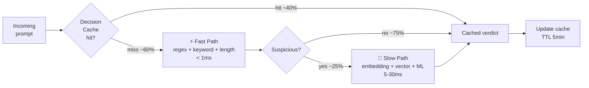

# ADR-0002: Двухуровневый pipeline — Fast Path + Slow Path

| | |
|---|---|
| **Status** | Accepted |
| **Date** | 2026-09-27 |
| **Deciders** | Architecture Team, Performance Engineering |
| **Related** | ADR-0001, ADR-0003, ADR-0009, ADR-0010 |

## Context

Бюджет задержки inline-инспекции: **p99 < 50 ms** поверх базовой задержки LLM-вызова. При этом полный конвейер сканирования включает:

1. Rule engine (regex): ~0.1–1 ms
2. Embedding: ~3–8 ms (GPU) или 15–30 ms (CPU)
3. Vector search (HNSW, top-K=10): ~5–30 ms
4. ML classifier (DeBERTa inference): ~5–10 ms (GPU), ~15–40 ms (CPU)
5. PDP (OPA): ~1–2 ms
6. Audit write (sync): ~1–2 ms
7. Redactor (PII detection + Vault roundtrip): ~3–5 ms

Сумма: **18–90 ms**. Это означает, что ~30% запросов не уложатся в p99 budget при последовательном выполнении всех детекторов.

### Forces

- **SLO budget**: p99 < 50 ms, p50 < 5 ms.
- **Типичный трафик**: 60–80% промптов — короткие benign-сообщения («hi», «translate this», system prompts), не требующие глубокого анализа.
- **Cache hit rate**: для типичного AI-приложения ~40% промптов повторяются (FAQ, system prompts, приветствия).
- **Стоимость ML-инференса**: каждый вызов embedding/classifier = деньги (GPU время). Лишние вызовы удорожают систему.
- **Точность**: нельзя полностью отказаться от slow path — novel attacks ловятся только векторным поиском + ML.

## Decision

**Разделить pipeline на два пути:**

- **Fast Path** (< 1 ms) — выполняется для **каждого** запроса: Decision Cache lookup → Rule Engine (regex, keyword, length). Если fast path даёт однозначный вердикт «clean» — запрос отправляется без slow path.
- **Slow Path** (5–30 ms) — выполняется только если:
  - Fast path пометил запрос как «suspicious» (сработал regex/keyword), **ИЛИ**
  - Промпт длиннее порога (например, > 200 токенов — длинные промпты чаще содержат атаки), **ИЛИ**
  - Включён режим «deep scan» для данного tenant'a (compliance-strict mode).



### Параметры (initial values, требуют тюнинга на реальном трафике)

| Параметр | Начальное значение | Тюнинг |
|---|---|---|
| Cache TTL | 5 минут | Зависит от частоты обновления threat-intel |
| Cache size | 100K entries (LRU) | Зависит от RAM |
| Порог «подозрительности» fast path | ≥ 1 regex match OR length > 200 tokens | Тюнинг FP/FN |
| Доля запросов в slow path (target) | < 25% | Если > 40% — пересматривать regex |

### Ожидаемое распределение задержки

| Метрика | Без разделения | С разделением |
|---|---|---|
| p50 | 25 ms | 1 ms (cache hit) или 1 ms (fast clean) |
| p95 | 60 ms | 30 ms (slow path) |
| p99 | 90 ms | 50 ms (slow path worst case) |
| GPU-загрузка (embedding) | 100% запросов | 25% запросов |
| Стоимость GPU | 100% | 25% (4× экономия) |

## Consequences

### Positive

- ✅ p50 latency падает с 25 ms до ~1 ms для большинства трафика.
- ✅ GPU-нагрузка падает в ~4 раза — экономия на inference cost.
- ✅ Cache hit → практически нулевая задержка для повторяющихся промптов.
- ✅ Slow path можно независимо обновлять (модели, индекс) без влияния на fast path.
- ✅ При сбое slow path можно деградировать до fast-only (см. ADR-0008).

### Negative

- ❌ Fast path — единственный детектор для ~75% трафика. Если regex неполный — часть атак пропустит.
- ❌ Кеш создаёт окно уязвимости: новый jailbreak появится в threat-intel, но старые вердикты в кеше ещё 5 минут возвращают «clean». Митигация: invalidate cache по сигналу threat-intel update.
- ❌ Сложнее отлаживать: при репорте FP/FN нужно знать, какой path сработал. Требуется явно логировать scan_path в audit.
- ❌ Tuning порога «подозрительности» — постоянная работа. Нужно A/B-тестировать.

### Neutral

- ➖ Логика «подозрительности» вынесена в отдельный компонент (Suspicion Tagger) — можно тюнить отдельно.
- ➖ Decision Cache можно позже расширить до «pre-computed verdicts for known-benign system prompts».

## Alternatives Considered

### Alternative A: Все детекторы параллельно (fan-out)

```
prompt ──┬─> regex ────────────────┐
         ├─> embedding ────────────>│
         ├─> vector search ────────>│──> PDP
         └─> ML classifier ────────┘
```

| Аспект | Оценка |
|---|---|
| Pros | Максимальная точность — все детекторы всегда работают, p99 = max(durations) ≈ 30 ms |
| Cons | GPU-нагрузка 100%, стоимость 4×, p50 = 30 ms (всегда slow) |
| Why rejected | Не уложиться в p50 < 5 ms бюджет. Экономически нецелесообразно для 75% benign-трафика |

**Вердикт:** Отклонено как primary. Возможно для compliance-strict mode отдельного tenant'а.

### Alternative B: Sequential pipeline без кеширования

```
prompt ──> regex ──> embedding ──> vector search ──> ML ──> PDP
```

| Аспект | Оценка |
|---|---|
| Pros | Простота реализации, нет проблем с cache invalidation |
| Cons | p99 ≈ 90 ms, GPU-нагрузка 100% |
| Why rejected | Не уложиться в SLO, дорогой GPU-инференс |

**Вердикт:** Отклонено.

### Alternative C: Adaptive pipeline с ML-маршрутизатором

Лёгкая ML-модель («triaje») решает, какой набор детекторов запустить для данного промпта.

| Аспект | Оценка |
|---|---|
| Pros | Идеально адаптивно, минимальная средняя стоимость |
| Cons | Сам triaje-классификатор = 2–5 ms, плюс он может ошибаться; explainability проблема (почему пропустили детектор?) |
| Why rejected | Сложность оправдана только при очень больших нагрузках (> 10K RPS). На текущем масштабе overengineering |

**Вердикт:** Возможно в Enterprise Phase 3.

## Related Decisions

- **ADR-0001** (Reverse Proxy) — fast/slow path реализуются внутри reverse proxy.
- **ADR-0003** (Streaming Inspection) — fast path также работает на чанках стриминга.
- **ADR-0008** (Circuit Breaker) — fallback до fast-only при сбое slow path.
- **ADR-0009** (Embedding Service) — кеш embeddings вынесен в отдельный сервис.
- **ADR-0010** (ML Classifier) — slow path включает ML-классификатор.

## References

- [Circuit Breaker Pattern](https://martinfowler.com/bliki/CircuitBreaker.html) — Martin Fowler
- [Latency SLO budgeting](https://sre.google/workbook/alerting-on-slos/) — Google SRE Workbook
- ARCHITECT.md, раздел 6.1 — описание fast/slow path
