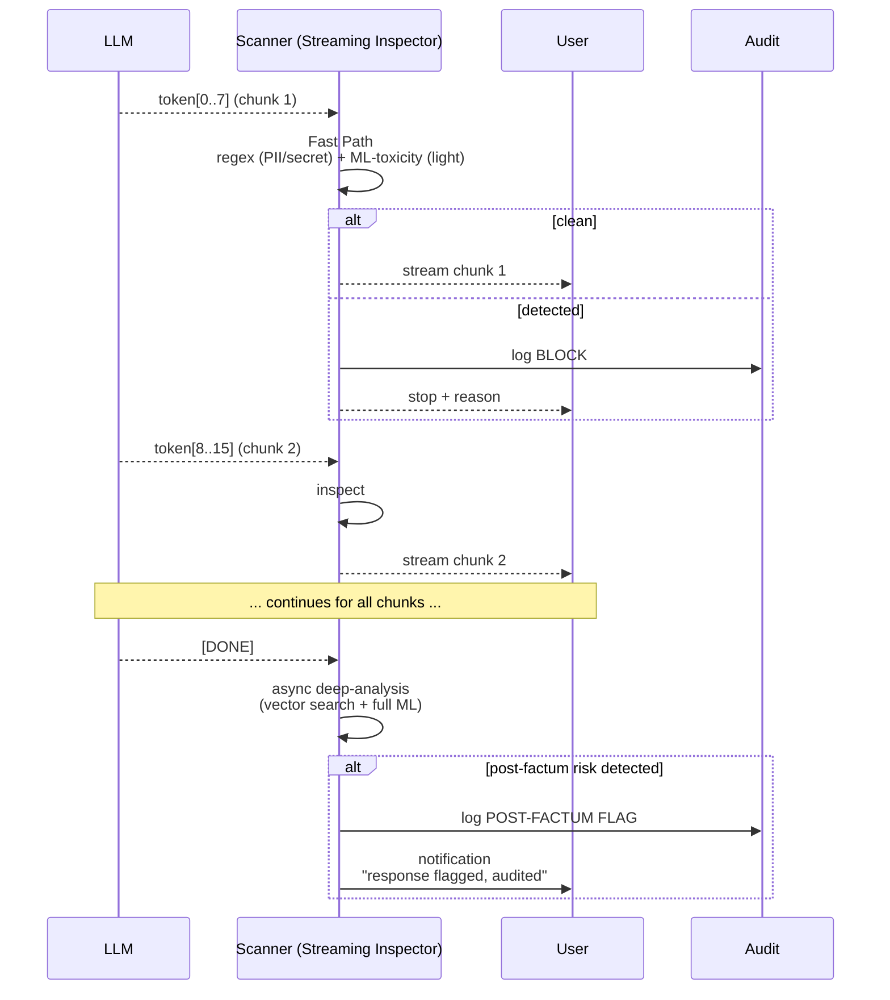

# ADR-0003: Streaming-инспекция «окнами» по N=8 токенов

| | |
|---|---|
| **Status** | Accepted |
| **Date** | 2026-09-27 |
| **Deciders** | Architecture Team, UX Engineering |
| **Related** | ADR-0001, ADR-0002, ADR-0007, ADR-0008 |

## Context

LLM-провайдеры отдают ответы в режиме **streaming** (Server-Sent Events / WebSocket / gRPC streaming). Пользователь ожидает начать видеть ответ **сразу после первого токена**, а не после полной генерации. Типичная генерация — 200–500 токенов, полное время — 3–15 секунд. Если сканер буферизует всю генерацию для проверки, пользователь ждёт лишние 3–15 секунд — это **UX-провал** для чат-продуктов.

В исходной архитектуре презентации генерация проверяется **как целое** — это противоречит streaming-парадигме.

### Forces

- **UX budget**: пользователь должен начать видеть первый токен не позднее 200 ms после отправки промпта.
- **Безопасность**: нельзя пропускать токены без проверки — могут содержать PII, секреты, токсичность.
- **Multi-token атаки**: некоторые угрозы (например, вывод секретного system prompt) растянуты на N токенов, не видны на отдельных чанках.
- **Cost**: глубокая проверка каждого токена через vector search + ML непомерно дорога.
- **Block UX**: при обнаружении угрозы нужно уметь **оборвать** stream gracefully с понятным сообщением.

## Decision

**Принять схему чанковой инспекции с параметром N=8 токенов.**

### Параметры

| Параметр | Значение | Обоснование |
|---|---|---|
| Размер чанка (N) | **8 токенов** | Баланс: 4 — слишком частая проверка (overhead), 16 — слишком долго ждать до первой проверки |
| Inline-детекторы на чанке | regex (PII, secrets, URLs), lightweight ML toxicity (RoBERTa-tiny, < 2 ms) | Только быстрые — иначе UX-бюджет пробивается |
| Буфер перед проверкой | 1 чанк (8 токенов) | Минимальная задержка до первого токена |
| Async post-factum проверка | Полная генерация → embedding → vector search → ML classifier | Ловит multi-token атаки, не влияет на UX |
| Действие при inline-block | terminate stream + send `{type: "blocked", reason: "..."}` | Стандартный SSE event |
| Действие при post-factum flag | Уведомление в SecOps + пометка в audit | Не прерывает уже показанный пользователю контент |

### Классификация угроз: что ловится inline vs async

| Класс угрозы | Inline (per-chunk) | Async (post-factum) |
|---|---|---|
| PII (SSN, email, passport) | ✅ regex | — |
| Secrets (AWS keys, JWT, credit cards) | ✅ regex | — |
| URL leakage | ✅ regex | — |
| Toxicity / profanity | ✅ lightweight ML | ✅ (better context) |
| Prompt injection echo (LLM повторяет вредоносную инструкцию) | ❌ | ✅ |
| System prompt leakage | ❌ | ✅ |
| Hallucination patterns | ❌ | ✅ |
| Topic-policy violation | ❌ | ✅ |

## Consequences

### Positive

- ✅ UX-приемлемая задержка: < 5 ms overhead per chunk.
- ✅ Блокировка on-the-fly: при обнаружении PII/secrets в чанке — немедленный stop.
- ✅ Async-анализ ловит «тонкие» угрозы без задержки UX.
- ✅ Параметр N — траблшутится под конкретный трафик (можно A/B).

### Negative

- ❌ Multi-token атаки **внутри одного чанка** могут быть пропущены (8 токенов = ~32 символа — может вместить короткий джейлбрейк). Митигация: async post-factum проверка всей генерации.
- ❌ При inline-block — пользователь уже увидел часть опасного контента. Mitigation: блокируем на **буфере до отправки** (т.е. инспектируем chunk N, отправляем chunk N-1).
- ❌ Async post-factum flag не позволяет отозвать уже показанный контент — нужно явно уведомлять пользователя.
- ❌ Размер чанка N=8 требует эмпирической калибровки на реальном трафике.

### Neutral

- ➖ Стандартный SSE-формат с дополнительным event-type `{type: "scanner_blocked"}` — клиенты должны поддерживать.
- ➖ Audit log содержит два типа записей: `inline_block` (срезано на чанке) и `post_factum_flag` (помечено post-factum).

## Alternatives Considered

### Alternative A: Буферизовать всю генерацию перед проверкой

| Аспект | Оценка |
|---|---|
| Pros | Полная инспекция, multi-token атаки ловятся на 100% |
| Cons | Latency до первого токена = полная latency генерации (3–15 s) |
| Why rejected | UX-провал. Пользователи не будут пользоваться продуктом |

**Вердикт:** Отклонено.

### Alternative B: Стримить без проверки, проверять только post-factum

| Аспект | Оценка |
|---|---|
| Pros | Нулевая задержка, простая реализация |
| Cons | PII/secrets/toxicity показываются пользователю **до** блокировки — безопасность нулевая |
| Why rejected | Противоречит назначению сканера |

**Вердикт:** Отклонено.

### Alternative C: Проверять каждый токен отдельно

| Аспект | Оценка |
|---|---|
| Pros | Минимальная задержка до первого токена, максимальная granularность |
| Cons | Regex на 1 токене почти не работает (PII обычно занимает несколько токенов). Overhead на ML ~5 ms на каждый токен = +50% latency LLM |
| Why rejected | Overhead непропорционален полезности |

**Вердикт:** Отклонено.

### Alternative D: Скользящее окно (sliding window) с перекрытием

Проверять каждые 4 токена на окне в 8 токенов (50% overlap).

| Аспект | Оценка |
|---|---|
| Pros | Ловит атаки, начинающиеся в середине чанка |
| Cons | 2× вычислений, сложность реализации |
| Why rejected | Async post-factum check покрывает этот класс атак дешевле |

**Вердикт:** Возможно в Enterprise Phase 3 для compliance-strict mode.

### Alternative E: LLM-as-judge на каждом чанке

Вызов отдельной LLM для оценки «безопасен ли этот чанк».

| Аспект | Оценка |
|---|---|
| Pros | Лучшая семантическая точность |
| Cons | 100–500 ms latency per chunk — пробивает UX-бюджет в разы |
| Why rejected | Несовместимо с streaming UX |

**Вердикт:** Отклонено. LLM-as-judge — только в async post-factum режиме для high-risk tenant'ов.

## Related Decisions

- **ADR-0001** (Reverse Proxy) — proxy должен поддерживать SSE/WebSocket/gRPC streaming.
- **ADR-0002** (Fast/Slow Path) — fast path работает на чанках, slow path — async post-factum.
- **ADR-0007** (PII Redaction via Vault) — regex-часть inline-инспекции использует Vault для токенизации.
- **ADR-0008** (Circuit Breaker) — при сбое inline-детекторов → fallback на «log-only stream» (стримим с пометкой «unscanned»).

## References

- [Server-Sent Events spec](https://developer.mozilla.org/en-US/docs/Web/API/Server-sent_events) — MDN
- [OpenAI streaming API](https://platform.openai.com/docs/api-reference/streaming) — референс реализации
- OWASP LLM Top 10 — LLM02 (Insecure Output Handling) — обоснование необходимости инспекции генераций
- ARCHITECT.md, раздел 6.2 — диаграмма streaming-инспекции
