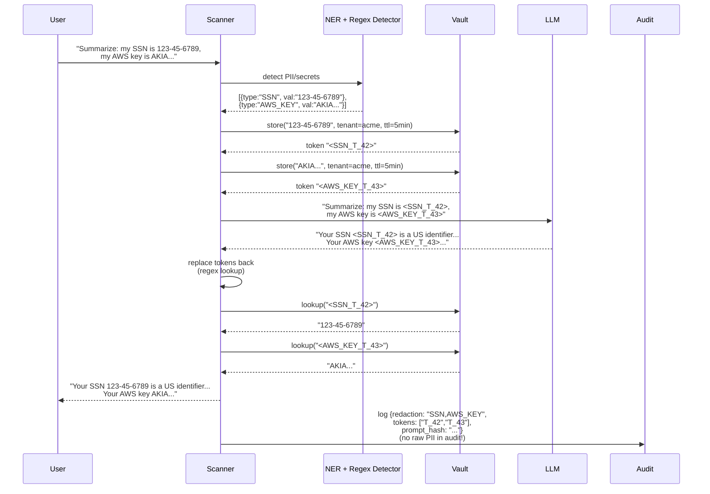

# ADR-0007: Tokenization PII/secrets через Vault

| | |
|---|---|
| **Status** | Accepted |
| **Date** | 2026-09-27 |
| **Deciders** | Architecture Team, Compliance, SecEng |
| **Related** | ADR-0003, ADR-0006, ADR-0011 |

## Context

Пользователь отправляет промпты, содержащие PII (SSN, email, паспорт, телефон) и секреты (AWS keys, JWT, API tokens, credit cards). Эти данные не должны попадать в LLM-провайдер по нескольким причинам:

1. **GDPR / ФЗ-152** — передача PII в сторонний LLM-сервис без DPA — нарушение.
2. **Secret leakage** — LLM может «запомнить» секрет и выдать его другому пользователю.
3. **LLM logs** — LLM-провайдеры логируют запросы (для safety/abuse monitoring). Секреты утекут в их логи.
4. **Audit risk** — если атакующий получит доступ к логам LLM, увидит секреты.

В исходной архитектуре презентации **нет модуля redaction** — это критический провал.

### Forces

- **Latency**: redaction должен добавлять < 5 ms к inline-проверке.
- **Reversibility**: пользователь, получивший ответ LLM с `<TOKEN_42>`, должен развернуть его обратно в реальное значение.
- **TTL**: токены не должны жить вечно (риск кражи токена = кража значения).
- **Multi-tenancy**: токены Tenant A не должны быть разворачиваемы Tenant B.
- **Audit**: audit log сканера не должен содержать исходные PII/secrets.
- **Streaming**: redaction должен работать на streaming-чанках (ADR-0003).
- **Accuracy**: regex не ловит всё (нестандартные PII). Нужен NER.

## Decision

**Принять Vault-базированную tokenization схему с коротким TTL.**



### Компоненты детекции

| Детектор | Технология | Что ловит |
|---|---|---|
| Regex Rules | Hyperscan / RE2 | SSN, credit cards, AWS keys, JWT, URLs, email |
| NER Model | Presidio (Microsoft) + custom NER | Имена, адреса, номера паспортов (RU), номера телефонов |
| Secret Scanner | TruffleHog / gitleaks patterns | 800+ типов секретов |

### Vault

- **HashiCorp Vault** (on-prem primary) или **AWS Secrets Manager** (SaaS).
- **Tokenization secrets engine** — отдельный namespace per tenant.
- **TTL**: 5 минут (настраивается per tenant).
- **Auto-cleanup**: expired tokens автоматически удаляются.
- **HA mode**: 3 Vault-ноды, Raft consensus.

### Token format

```
<TYPE_T_ID>
  │     │
  │     └── ID (base36, 8 chars) — lookup key в Vault
  └── тип: SSN, AWS_KEY, EMAIL, PHONE, PASSPORT_RU, ...
```

### Audit logging

Audit log сканера **не содержит** исходные PII/secrets:
- Записывается только `{type, token_id, detector, ts}`.
- Исходные значения — только в Vault (с TTL).

## Consequences

### Positive

- ✅ LLM никогда не видит реальные PII/secrets — комплаенс с GDPR/ФЗ-152.
- ✅ LLM-логи провайдера не содержат утечек (только tokens).
- ✅ Audit log сканера — PII-free, можно отдавать на анализ SecOps без доп. redaction.
- ✅ TTL гарантирует cleanup — нет бесконечно живущих секретов.
- ✅ Multi-tenant: токены изолированы per tenant (Vault namespaces).

### Negative

- ❌ Vault — ещё один SPOF (митигация: HA mode, ADR-0008 fallback).
- ❌ Vault roundtrip добавляет 1–3 ms на каждый PII/secrets в промпте.
- ❌ Замена token-back в streaming — нужно буферизовать chunk до завершения reverse-lookup (ADR-0003).
- ❌ NER-модель не идеальна: нестандартные PII пропустит. Mitigation: белый/чёрный список регулярных выражений + регулярный retrain.
- ❌ Token format засветится в LLM-логах — атакующий может попытаться brute-force token → но ID — random base36 8 chars = 36^8 = 2.8T вариантов.

### Neutral

- ➖ Vault — отдельный сервис, нужен monitoring и backups.
- ➖ Cost: Vault Enterprise ~$100K/year. Для on-prem можно использовать OpenBao (fork).

## Alternatives Considered

### Alternative A: Inline reversible encryption (AES-GCM)

Шифровать PII на лету, LLM видит ciphertext.

| Аспект | Оценка |
|---|---|
| Pros | Не нужен Vault, низкая задержка |
| Cons | LLM-контекст будет содержать nonsense (ciphertext base64), что снизит качество генерации. LLM не сможет «понять» структуру |
| Why rejected | Качество LLM-ответа деградирует. Tokenization сохраняет структуру («<SSN_T_42>» — LLM понимает это как placeholder) |

**Вердикт:** Отклонено.

### Alternative B: Format-Preserving Encryption (FPE)

Шифровать SSN → другой SSN-формат-совместимый токен.

| Аспект | Оценка |
|---|---|
| Pros | LLM видит «валидный» SSN, не догадывается о токенизации |
| Cons | Сложность реализации (FPE стандарта NIST), утечка структуры |
| Why rejected | Overengineering для нашей задачи. LLM не требует валидности структуры, чтобы понимать контекст |

**Вердикт:** Возможно для финансового сектора Phase 4.

### Alternative C: Masking (просто `***`)

Заменять PII на `***`.

| Аспект | Оценка |
|---|---|
| Pros | Максимально просто |
| Cons | Нереверсивно — LLM-ответ будет содержать `***`, пользователь не получит реальное значение обратно |
| Why rejected | Не подходит — пользователь должен получить ответ с реальными значениями |

**Вердикт:** Отклонено.

### Alternative D: Microsoft Presidio with built-in anonymizer

Использовать Presidio с custom anonymizer, который хранит mapping в Redis.

| Аспект | Оценка |
|---|---|
| Pros | Простой stack, Presidio — proven solution |
| Cons | Redis — не tamper-evident, нет built-in TTL rotation, нет per-tenant isolation |
| Why rejected | Vault даёт более зрелый security model (audit, ACL, multi-tenant) |

**Вердикт:** Возможно для dev-окружений.

## Related Decisions

- **ADR-0003** (Streaming Inspection) — redaction работает per-chunk, обратная подстановка — на финальной генерации.
- **ADR-0006** (Hashchain Audit) — audit log содержит только token IDs, не исходные значения.
- **ADR-0008** (Circuit Breaker) — fallback при недоступности Vault.
- **ADR-0011** (Multi-tenancy) — Vault namespaces для per-tenant изоляции.

## References

- [HashiCorp Vault Tokenization Secrets Engine](https://developer.hashicorp.com/vault/docs/secrets/tokenization)
- [Microsoft Presidio](https://microsoft.github.io/presidio/)
- [TruffleHog secret patterns](https://github.com/trufflesecurity/trufflehog)
- [GDPR Article 32 — Security of processing](https://gdpr-info.eu/art-32-gdpr/)
- ФЗ-152 (Россия) — закон о персональных данных
- ARCHITECT.md, раздел 6.7 — диаграмма redaction через Vault
