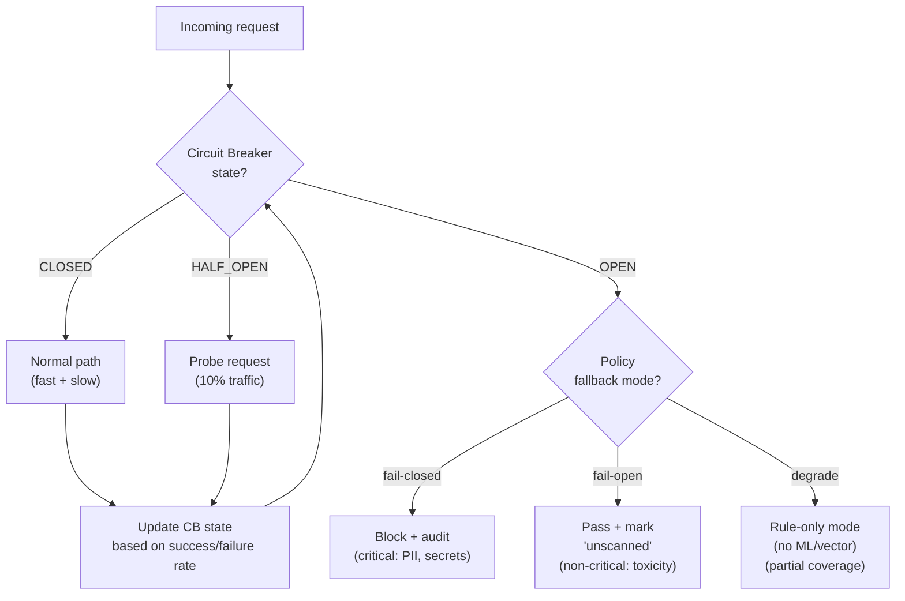

# ADR-0008: Circuit Breaker с 3 режимами failover

| | |
|---|---|
| **Status** | Accepted |
| **Date** | 2026-09-27 |
| **Deciders** | Architecture Team, SRE |
| **Related** | ADR-0001, ADR-0002, ADR-0007, ADR-0009, ADR-0010 |

## Context

Сканер — это security-инструмент, но **он сам не должен стать причиной отказа AI-приложения**. Базовый принцип SRE: «security tooling must not be a SPOF for the protected system». Если векторная БД, ML-классификатор или Vault упали — AI-приложение должно продолжать работать (в деградированном режиме).

В исходной архитектуре презентации **нет отказоустойчивости** — это критический провал для production-системы.

### Forces

- **Availability budget**: 99.95% availability сканера → 99.99% availability AI-приложения (с fallback).
- **Latency**: даже в деградированном режиме — p99 < 100 ms.
- **Safety vs Liveness**: для критичных политик (PII leakage) — лучше заблокировать, чем пропустить. Для некритичных (toxicity) — лучше пропустить с пометкой, чем сломать продукт.
- **Auto-recovery**: сканер должен автоматически возвращаться в нормальный режим после восстановления upstream.
- **Observability**: SecOps должен видеть состояние circuit breaker'ов в dashboard.

## Decision

**Принять схему circuit breaker с 3 режимами fallback, параметризуемыми per-policy.**



### Состояния Circuit Breaker (per upstream component)

| Состояние | Описание | Условия перехода |
|---|---|---|
| **CLOSED** | Нормальный режим, все запросы идут в upstream | По умолчанию |
| **OPEN** | Upstream недоступен, запросы сразу fallback | > 5 ошибок за 10 секунд ИЛИ > 50% ошибок за 30 секунд |
| **HALF_OPEN** | Пробуем upstream, пропуская 10% трафика | После cooldown 30 секунд в OPEN |

### Режимы fallback (per policy, конфигурируется в OPA)

| Режим | Когда применяется | Поведение | Пример |
|---|---|---|---|
| `fail-closed` | Критичные политики | Block запрос + audit с причиной `upstream_unavailable` | PII leakage, secret leakage — лучше не пропустить, чем утечь |
| `fail-open` | Некритичные политики | Пропустить запрос с заголовком `X-Scanner-Status: unscanned` | Toxicity, profanity — лучше пропустить, чем сломать продукт |
| `degrade` | Деградируемые компоненты | Fast path (rules) работает, slow path (vector/ML) выключен | Vector DB down → правил недостаточно, но ловит regex-ataki |

### Настройка per-component

| Component | Default fallback | Настройка |
|---|---|---|
| Vector DB (Qdrant) | `degrade` (rule-only) | Policy `pii_leakage` → `fail-closed` |
| ML Classifier | `degrade` (rule-only) | Policy `prompt_injection` → `fail-closed` if `tenant=financial` |
| Vault (Redaction) | `fail-closed` (block PII) | Никогда не `fail-open` — иначе PII уйдёт в LLM |
| Audit Store | `fail-open` (pass + counter) | Audit failure не должен ломать продукт, но алертится |
| OPA Bundle Service | `fail-open` (use last cached bundle) | Cache позволяет работать даже при недоступности OPA distribution |
| LLM Provider | N/A (это сам защищаемый сервис) | Сканер не отвечает за доступность LLM |

### Реализация

Библиотека circuit breaker — например, `pybreaker` (Python), `failsafe-go` (Go). Хранится состояние per-upstream в Redis (для shared state между репликми сканера).

```python
import pybreaker

vector_db_breaker = pybreaker.CircuitBreaker(
    fail_max=5,
    reset_timeout=30,
    listeners=[metrics_listener, alerting_listener]
)

@vector_db_breaker
def vector_search(query_vector, top_k):
    return qdrant_client.search(query_vector, top_k)

# Fallback: если vector_search упадёт 5 раз подряд, breaker OPEN,
# все последующие вызовы сразу кидают CircuitBreakerError,
# который ловится в orchestrator и переключает на rule-only режим
```

### Observability

Метрики в Prometheus:
```
scanner_circuit_breaker_state{component="vector_db"}  # 0=CLOSED, 1=OPEN, 2=HALF_OPEN
scanner_circuit_breaker_failures_total{component="vector_db"}
scanner_circuit_breaker_fallback_invocations_total{component="vector_db", mode="degrade"}
```

Алерт в Alertmanager:
- `CircuitBreakerOpen` — Critical, если OPEN > 1 минуты.
- `FallbackModeHighRate` — Warning, если > 10% трафика идёт в fallback.

## Consequences

### Positive

- ✅ AI-приложение продолжает работать при сбоях upstream сканера.
- ✅ Критичные политики (PII/secrets) по умолчанию fail-closed — не пропустят утечку.
- ✅ Некритичные (toxicity) fail-open — не сломают UX.
- ✅ Degrade mode даёт частичную защиту даже при сбое ML/Vector.
- ✅ Auto-recovery через HALF_OPEN — без ручного вмешательства.
- ✅ Observability: состояние CB видно в dashboard.

### Negative

- ❌ Fail-open режим — реально пропускает без проверки. SecOps должен явно принимать решение какие политики fail-open.
- ❌ Fail-closed — пользователи видят блокировку «по причине сбоя сканера», может негативно влиять на UX.
- ❌ Состояние CB в Redis — ещё одна зависимость (можно embedded in-memory, но тогда per-replica).
- ❌ HALF_OPEN probe traffic (10%) — при восстановлении upstream 10% трафика может получить ошибки.

### Neutral

- ➖ Thresholds (5 errors / 30 sec) — требуют тюнинга под реальный трафик.
- ➖ Manual override — оператор может вручную открыть/закрыть CB через admin API.

## Alternatives Considered

### Alternative A: Без circuit breaker — все запросы идут напрямую

| Аспект | Оценка |
|---|---|
| Pros | Простота |
| Cons | Один сбой upstream → cascade failure всего AI-приложения. Нарушает SRE principle "security tooling must not be SPOF" |
| Why rejected | Прямое нарушение availability SLO |

**Вердикт:** Отклонено.

### Alternative B: Простой retry без fallback

| Аспект | Оценка |
|---|---|
| Pros | Простота, ловит transient errors |
| Cons | При persisting failure — все запросы ретраятся → exacerbate load, latency растёт, cascade failure |
| Why rejected | Не решает persisting failure. CB нужен поверх retry |

**Вердикт:** Используется вместе с CB (retry внутри CLOSED state).

### Alternative C: Bulkhead pattern (изоляция ресурсов)

Каждый upstream — в отдельном pool с лимитом connections.

| Аспект | Оценка |
|---|---|
| Pros | Изоляция, один медленный upstream не исчерпает pool |
| Cons | Не решает логику решения при сбое (нужен CB сверху) |
| Why rejected | Дополняет CB, не заменяет. Принять как дополнение |

**Вердикт:** Принять как дополнение к CB. Используется connection pool per upstream с лимитами.

### Alternative D: Always fail-closed (максимальная безопасность)

| Аспект | Оценка |
|---|---|
| Pros | Максимальная безопасность — никогда не пропустит угрозу |
| Cons | Любой сбой = полной недоступности AI-приложения. 99.95% availability сканера = 4.4 часа downtime/год |
| Why rejected | Слишком жёстко. Разные политики имеют разный risk appetite |

**Вердикт:** Отклонено как primary, возможно для regulated financial в Phase 4.

## Related Decisions

- **ADR-0001** (Reverse Proxy) — CB реализуется внутри proxy, чтобы не быть SPOF.
- **ADR-0002** (Fast/Slow Path) — при OPEN CB slow path → degrade to fast only.
- **ADR-0007** (Vault) — Vault fallback всегда fail-closed.
- **ADR-0009** (Embedding) — CB для embedding service.
- **ADR-0010** (ML Classifier) — CB для classifier.

## References

- [Martin Fowler: Circuit Breaker](https://martinfowler.com/bliki/CircuitBreaker.html)
- [Netflix Hystrix](https://github.com/Netflix/Hystrix/wiki/How-it-Works) — original implementation
- [SRE Book: Cascading Failures](https://sre.google/sre-book/handling-overload/)
- [pybreaker library](https://pypi.org/project/pybreaker/)
- ARCHITECT.md, раздел 6.3 — circuit breaker diagram
