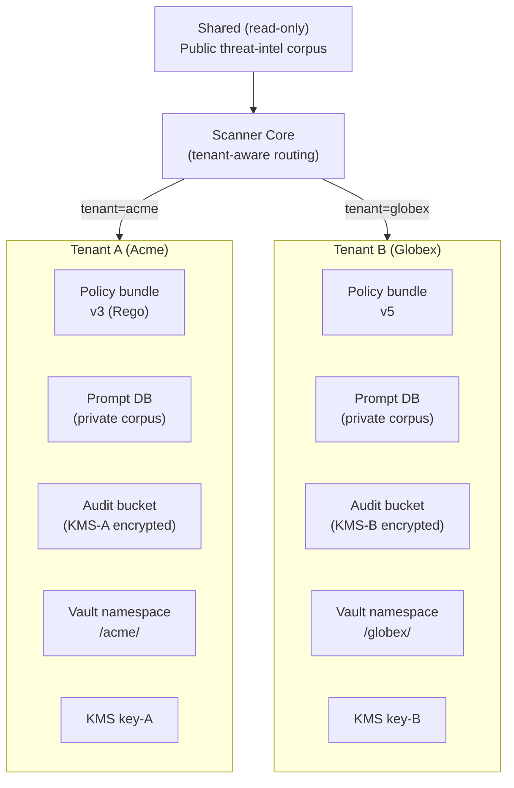

# ADR-0011: Мультиарендность — per-tenant KMS, policies, audit

| | |
|---|---|
| **Status** | Accepted |
| **Date** | 2026-09-27 |
| **Deciders** | Architecture Team, SecEng, Compliance |
| **Related** | ADR-0004, ADR-0005, ADR-0006, ADR-0007 |

## Context

LLM Security Scanner планируется как SaaS-продукт (Phase 3) и как on-prem product для нескольких команд внутри организации (Phase 2). Это означает мультиарендность: один экземпляр сканера обслуживает несколько независимых tenant'ов (клиентов/команд), между которыми **не должно быть утечки данных**.

Требования к изоляции:
- **Policy isolation**: Tenant A не может видеть политики Tenant B.
- **Prompt DB isolation**: red-team корпус Tenant A не утекает в Tenant B.
- **Audit isolation**: audit log Tenant A недоступен Tenant B (даже через admin API).
- **Encryption isolation**: данные Tenant A шифруются отдельным ключом.
- **Per-tenant threat-intel**: один tenant может захотеть использовать свой приватный корпус атак (industry-specific).
- **Cross-tenant learning (опционально)**: при согласии tenant'ов — обновления threat-intel распространяются на всех.

В исходной архитектуре презентации мультиарендность не описана — это провал для SaaS-модели.

### Forces

- **Compliance**: GDPR требует, чтобы данные EU-клиентов не были доступны операторам из других регионов.
- **Cost**: полная изоляция (отдельный кластер per tenant) — дорого. Нужна logical isolation при shared infra.
- **Operability**: один ops-должен управлять всеми tenant'ами.
- **Perf**: изоляция не должна добавлять > 1 ms latency.
- **Auditability**: каждый tenant может заказать compliance audit своей части.

## Decision

**Принять схему logical multi-tenancy с per-tenant KMS-ключами, payload-filtered Qdrant и per-tenant Vault namespaces.**

### Уровни изоляции

| Уровень | Механизм | Что изолирует |
|---|---|---|
| **Network** | Отдельный ingress per tenant (hostname: `acme.scanner.io`, `globex.scanner.io`) | Логический boundary |
| **Auth** | Per-tenant API keys + JWT с `tenant_id` claim | Доступ |
| **KMS** | Per-tenant CMK (Customer Master Key) в Vault/KMS | Шифрование at-rest |
| **Vector DB** | Payload filter `tenant_id` на каждом search в Qdrant | Изоляция корпуса атак |
| **Policy Store** | Per-tenant OPA bundle (отдельный namespace в Git) | Политики |
| **Audit Store** | Per-tenant S3 bucket / MinIO path с KMS-шифрованием | Audit log |
| **Vault** | Per-tenant Vault namespace | Tokenized secrets |
| **Metrics** | Per-tenant Prometheus labels (tenant_id) | Observability |

### Архитектура



### Routing

```python
def handle_request(req):
    tenant_id = extract_tenant_from_jwt(req.headers["Authorization"])
    # All downstream calls carry tenant_id
    context = TenantContext(
        tenant_id=tenant_id,
        policy_bundle=get_active_policy_bundle(tenant_id),
        vault_namespace=f"/{tenant_id}/",
        kms_key=get_tenant_kms_key(tenant_id),
    )
    # Vector DB queries include payload filter
    results = qdrant.search(
        vector=embedding,
        query_filter=Filter(
            must=[
                FieldCondition(
                    key="tenant_id",
                    match=MatchValue(value=tenant_id)
                ),
                # OR public threat-intel
                FieldCondition(
                    key="visibility",
                    match=MatchValue(value="public")
                ),
            ]
        ),
    )
```

### Per-tenant shared resources

| Ресурс | Shared? | Изоляция |
|---|---|---|
| Scanner pods | Shared | Tenant-id в context, нет изоляции на процессе |
| Qdrant | Shared | Payload filter (tenant_id) |
| Embedding model | Shared | Stateless, no tenant-specific data |
| ML Classifier | Per-tenant (опционально) | Default: shared fine-tuned; для Enterprise: per-tenant fine-tune |
| OPA Bundle | Per-tenant | Git namespace + signed bundle |
| Vault | Shared, namespace per tenant | Vault Enterprise feature |
| Audit Storage | Per-tenant bucket | KMS-ключ per tenant |
| Threat-intel corpus | Shared (read-only) | Public, доступно всем |

### Cross-tenant learning (opt-in)

По умолчанию — off. Tenant может дать consent (через UI настройки) на sharing своих labeled FP/FN в общий corpus для обучения будущих версий детекторов. Это улучшает детекторы для всех, но требует явного согласия.

## Consequences

### Positive

- ✅ Полная logical изоляция между tenant'ами.
- ✅ Per-tenant KMS — даже админ сканера не может расшифровать данные Tenant A без его ключа.
- ✅ Audit per-tenant — compliance-ready.
- ✅ Shared infra — экономия стоимости.
- ✅ Cross-tenant learning opt-in — коллективная безопасность (network effect).

### Negative

- ❌ Qdrant payload filter — на очень больших объемах (>100M vectors) и большом числе tenant'ов (>1000) начинается filter overhead. Mitigation: shard by tenant_id (отдельные collections per tenant для крупных).
- ❌ Vault Enterprise (namespaces) — платная лицензия (~$100K/year). Для on-prem можно использовать OpenBao.
- ❌ Per-tenant KMS-ключи — управление ключами усложняется (rotation, revocation).
- ❌ Multi-tenant context в коде — нужно везде пробрасывать tenant_id, риск утечки при ошибке разработчика.

### Neutral

- ➖ Shared ML classifier — одна модель на всех. Per-tenant fine-tune — Enterprise фича.
- ➖ Metrics и logs — все tenant'ы в одном Prometheus/Loki, разделены label'ом tenant_id. Audit access по RBAC.

## Alternatives Considered

### Alternative A: Silo per tenant (отдельный кластер)

| Аспект | Оценка |
|---|---|
| Pros | Максимальная изоляция, нет noisy neighbor, нет shared state |
| Cons | Cost × N tenant'ов. Operational overhead (N кластеров обновлять). Не масштабируется |
| Why rejected | Экономически нецелесообразно при > 10 tenant'ов |

**Вердикт:** Только для Enterprise tier (top-tier клиенты платят за dedicated).

### Alternative B: Single-tenant всегда (no SaaS)

| Аспект | Оценка |
|---|---|
| Pros | Простота, нет multi-tenancy complexity |
| Cons | Каждый деплой — отдельная установка. Невозможно monetize как SaaS |
| Why rejected | Бизнес требует SaaS-модели для масштабирования |

**Вердикт:** Отклонено как primary, остаётся для on-prem Enterprise.

### Alternative C: Database-level row-level security (RLS) в PostgreSQL

| Аспект | Оценка |
|---|---|
| Pros | ACID, простая модель, один БД-кластер |
| Cons | Не работает для Qdrant (no SQL). RLS — только PostgreSQL. Vector DB — отдельный сервис |
| Why rejected | Гибридная архитектура (Qdrant + Postgres + Vault) требует единой изоляции на app layer |

**Вердикт:** Используется для PostgreSQL (policy/audit metadata), но app-layer tenant_id обязателен везде.

### Alternative D: Cell-based architecture (each tenant → isolated cell with shared blueprints)

| Аспект | Оценка |
|---|---|
| Pros | Баланс между silo и shared |
| Cons | Сложно автоматизировать деплой. Для small tenants — overkill |
| Why rejected | Возможно для Enterprise tier. Default — logical multi-tenancy |

**Вердикт:** Возможно в Phase 4 для Enterprise tier.

## Related Decisions

- **ADR-0004** (OPA) — per-tenant policy bundles.
- **ADR-0005** (Qdrant) — payload filter для tenant isolation.
- **ADR-0006** (Hashchain Audit) — per-tenant audit buckets.
- **ADR-0007** (Vault) — per-tenant Vault namespaces.

## References

- [Multi-tenant SaaS architecture patterns](https://docs.microsoft.com/en-us/azure/architecture/guide/multitenant/considerations/tenancy-models)
- [Vault Namespaces](https://developer.hashicorp.com/vault/docs/concepts/namespaces)
- [Qdrant payload filtering](https://qdrant.tech/documentation/concepts/filtering/)
- [GDPR cross-border data transfer](https://edpb.europa.eu/our-work-tools/our-documents/guidelines/guidelines-22025-cross-border-data-transfers_en)
- ARCHITECT.md, раздел 6.6 — multi-tenancy diagram
