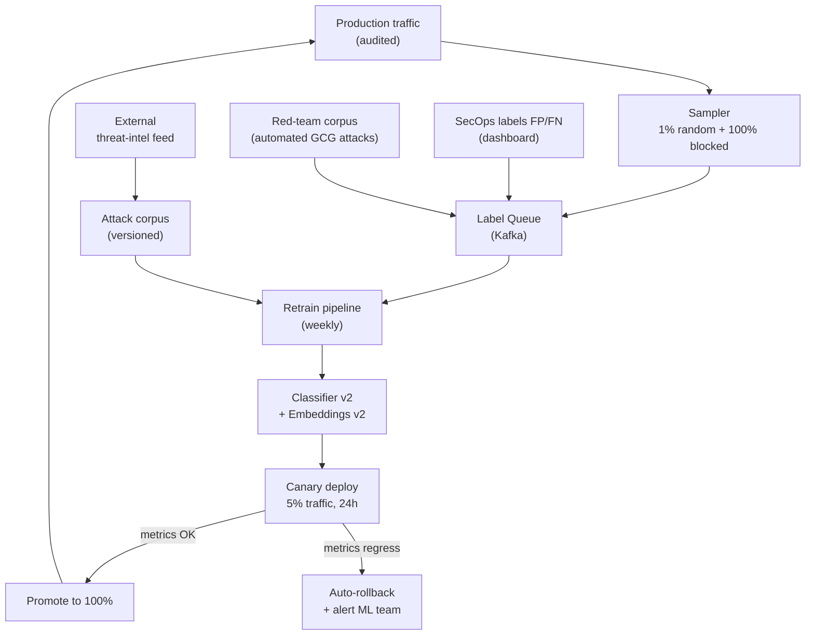

# ADR-0013: Feedback Loop с canary deploy и auto-rollback

| | |
|---|---|
| **Status** | Accepted |
| **Date** | 2026-09-27 |
| **Deciders** | Architecture Team, ML Engineering, SecEng |
| **Related** | ADR-0002, ADR-0009, ADR-0010, ADR-0012 |

## Context

Детекторы сканера будут деградировать со временем (concept drift):
- Появляются новые типы атак (нет в корпусе).
- False positives меняются в зависимости от домена клиента.
- LLM-модели эволюционируют, генерации меняют стилистику.

Без feedback loop:
- Точность падает на 5–15% за квартал,
- SecOps находит FP/FN, но некуда отправить,
- Невозможно data-driven улучшать детекторы.

В исходной архитектуре презентации feedback loop отсутствует.

### Forces

- **Continuous improvement**: модель должна улучшаться автоматически.
- **Safety**: новые модели могут регрессировать — нужен auto-rollback.
- **SecOps UX**: разметка FP/FN должна быть 1-click, иначе не будут размечать.
- **Cost**: retraining — дорогой. Нужен разумный schedule.
- **Privacy**: labels могут содержать sensitive prompts — нужна анонимизация.

## Decision

**Принять схему: feedback API → label queue → weekly retrain → canary deploy → auto-rollback.**



### Компоненты

#### Feedback API

- REST endpoint: `POST /feedback`
- Body: `{audit_event_id, label: "FP"|"FN", comment, labeled_by}`
- Auth: только SecOps role (RBAC).
- Label сохраняется в label queue (Kafka topic `feedback-labels`).

#### Sampler

- **Random 1%** всего трафика → в label queue (для непрерывной калибровки).
- **100% blocked events** → в label queue (для проверки FN — был ли блокировка корректной).
- **100% high-risk low-confidence** → в label queue (для edge cases).

Анонимизация: prompt_text хэшируется (SHA256) + заменяется PII через Vault tokenization (ADR-0007). В label queue — не PII, а `prompt_hash` + redacted text + detector scores + verdict.

#### Retrain pipeline

Schedule: weekly (Sunday 02:00 UTC).

```python
def retrain_pipeline():
    # 1. Pull all labeled data since last retrain
    new_labels = kafka.consume("feedback-labels", since=last_train_ts)
    
    # 2. Pull production samples (auto-labeled by verdict)
    auto_labels = generate_pseudo_labels_from_audit()
    
    # 3. Combine with red-team corpus
    train_data = combine(
        new_labels,
        auto_labels,
        red_team_corpus_v_latest,
        threat_intel_corpus_v_latest,
    )
    
    # 4. Train new classifier
    new_model = fine_tune_deberta(train_data)
    new_embeddings_model = fine_tune_e5(train_data)
    
    # 5. Validate on hold-out test set
    metrics = evaluate(new_model, holdout_test_set)
    
    if metrics.f1 < baseline_f1 * 0.95:  # 5% regression threshold
        alert_ml_team("Model regression detected")
        return None
    
    # 6. Register in model registry
    mlflow.register_model(new_model, name="prompt_classifier", version=next_version())
    
    # 7. Trigger canary deploy
    deploy_canary(version=next_version(), traffic_percentage=5)
```

#### Canary deploy

- Новая модель обслуживает 5% трафика (по user_id hash).
- Duration: 24 часа.
- Сравнение метрик: FP rate, FN rate, latency p99, throughput.

#### Auto-rollback

Метрики, отслеживаемые в реальном времени:

| Метрика | Threshold | Action |
|---|---|---|
| FP rate (canary) vs baseline | > +50% | Rollback |
| FN rate (canary) vs baseline | > +30% | Rollback |
| Latency p99 (canary) | > +50% | Rollback |
| Error rate | > 1% | Rollback |
| SecOps explicit feedback | "rollback" vote (manual) | Rollback |

Rollback — мгновенный (переключение конфига в OPA).

#### Model registry

- MLflow / DVC для версионирования моделей.
- Каждая модель: artifacts (weights), metrics, training data hash, code commit SHA.
- Audit log: какая модель deployилась когда, на каком % трафика, с каким результатом.

## Consequences

### Positive

- ✅ Continuous improvement — модель становится точнее со временем.
- ✅ Auto-rollback — защита от regression.
- ✅ SecOps involvement — они видят, что их labels реально используются.
- ✅ Canary — новые модели тестируются на безопасном % трафика.
- ✅ Privacy: labels не содержат PII (Vault tokens).

### Negative

- ❌ Weekly retrain — ML compute cost (~$50–100 per run на GPU).
- ❌ Canary 5% × 24h — если модель плохая, 5% × 1 день трафика пострадает.
- ❌ Hold-out test set может не покрывать novel attacks — нужны обновления test set'а.
- ❌ Pseudo-labels от production могут усиливать существующие смещения (reinforcement bias).

### Neutral

- ➖ MLflow — отдельная инфраструктура. Можно self-host (on-prem) или DVC (simpler).
- ➖ Red-team corpus — нужно поддерживать актуальным (ADR-0012 threat-intel sync).

## Alternatives Considered

### Alternative A: Continuous online learning (real-time updates)

| Аспект | Оценка |
|---|---|
| Pros | Мгновенная адаптация к новым атакам |
| Cons | Нестабильность (один FP-label может сильно изменить модель). Нет валидации. Reproducibility проблема |
| Why rejected | Production ML требует controlled batch retraining |

**Вердикт:** Отклонено. Возможно для embeddings similarity (incremental Qdrant updates).

### Alternative B: Manual retrain on demand (без schedule)

| Аспект | Оценка |
|---|---|
| Pros | Полный контроль |
| Cons | ML team забывает. Нет регулярности. Не scales |
| Why rejected | Не scales |

**Вердикт:** Отклонено.

### Alternative C: Buy pre-trained models от vendors (Lakera, Prompt Security)

| Аспект | Оценка |
|---|---|
| Pros | Не нужно строить ML-команду. Готовые детекторы |
| Cons | Vendor lock-in, нет custom под наши домены, paid subscription |
| Why rejected | Конкурентное преимущество — собственные детекторы под специфику клиентов. Hybrid: использовать vendor models как baseline + our fine-tune |

**Вердикт:** Возможно как baseline для cold-start. Phase 1 — buy, Phase 2+ — own.

### Alternative D: Active learning (модель сама выбирает, что разметить)

Sampler выбирает low-confidence examples для разметки SecOps.

| Аспект | Оценка |
|---|---|
| Pros | Минимум labels для максимума качества |
| Cons | Сложность — нужны uncertainty estimation методы |
| Why rejected | Overengineering для MVP. Возможно в Phase 3 |

**Вердикт:** Возможно в Phase 3.

## Related Decisions

- **ADR-0002** (Fast/Slow Path) — labels из slow path идут в feedback queue.
- **ADR-0009** (Embedding Service) — embeddings model retrained через pipeline.
- **ADR-0010** (ML Classifier) — classifier retrained через pipeline.
- **ADR-0012** (Threat Intel) — внешний corpus пополняет training data.

## References

- [MLflow Model Registry](https://mlflow.org/docs/latest/model-registry.html)
- [Canary Deployment Pattern](https://martinfowler.com/bliki/CanaryRelease.html)
- [Google: Rules of Machine Learning](https://developers.google.com/machine-learning/guides/rules-of-ml) — best practices
- [Continuous ML: Hidden Technical Debt in Machine Learning Systems](https://papers.nips.cc/paper/2015/hash/86df7dcfd896fcaf2674f757a2463eba-Abstract.html) — paper
- ARCHITECT.md, раздел 6.5 — feedback loop diagram
