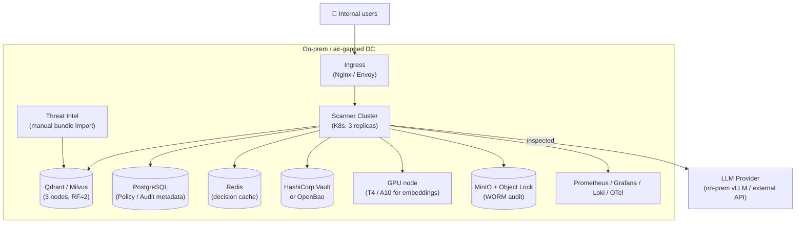
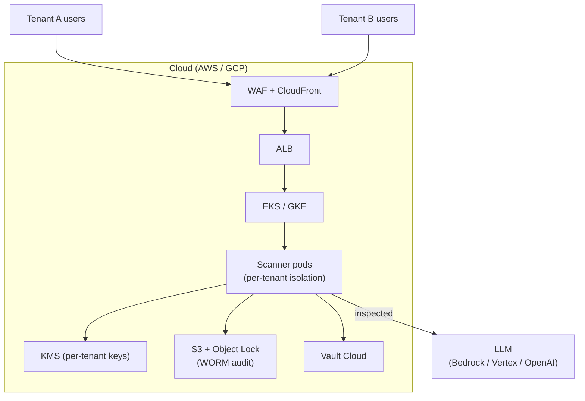

# ADR-0014: Deployment Topology — on-prem как primary target

| | |
|---|---|
| **Status** | Accepted |
| **Date** | 2026-09-27 |
| **Deciders** | Architecture Team, Platform Team, Business |
| **Related** | ADR-0001, ADR-0005, ADR-0007, ADR-0012 |

## Context

Презентация явно требует «локальное развёртывание» как архитектурное свойство. Это диктуется целевой аудиторией:
- **Банки и финтех** — regulated, PII/PCI данные не покидают периметр.
- **Госсектор** — ФЗ-152, ФСТЭК требования, air-gapped системы.
- **Healthcare** — HIPAA, пациентские данные.
- **Enterprise** — корпоративные AI-приложения с proprietary данными.

При этом часть клиентов готова к SaaS-модели (стартапы, SMB).

### Forces

- **Compliance**: on-prem обязательна для regulated industries.
- **Cost**: on-prem — CapEx (высокий вход, низкий TCO в долгую). SaaS — OpEx (pay-as-you-go).
- **Operations**: on-prem требует Linux/K8S-команды у клиента. SaaS — zero-ops для клиента.
- **Air-gapped**: ~30% целевых клиентов — air-gapped (no internet at all).
- **Updates**: on-prem сложнее обновлять. SaaS — centralised.
- **Multi-tenancy**: on-prem обычно single-tenant per customer. SaaS — multi-tenant.

## Decision

**Принять on-prem как primary target deployment, SaaS как secondary (Phase 3 Enterprise).**

### On-prem reference architecture



### Минимальные системные требования (MVP, single-tenant)

| Ресурс | Spec | Обоснование |
|---|---|---|
| Compute | 3 × 8 vCPU, 16 GB RAM | Scanner pods HA |
| GPU | 1 × NVIDIA T4 16GB | Embeddings + ML classifier |
| Storage (Qdrant) | 100 GB SSD | 1M vectors, 1024-dim |
| Storage (Audit WORM) | 500 GB | 1 year audit retention |
| Storage (Postgres) | 50 GB | Policies + metadata |
| Network | 1 Gbps internal | LLM streaming traffic |

### Деплоймент-механизмы

| Целевая аудитория | Механизм | Особенности |
|---|---|---|
| **Enterprise (with K8s)** | Helm chart | Standard K8s, values.yaml per tenant |
| **Enterprise (without K8s)** | Docker Compose | Один `docker compose up` |
| **Air-gapped** | Offline bundle (.tar.gz with all images) | Загрузка через USB / signed repo |
| **Single-server (PoC)** | Single binary + SQLite | Для PoC, не prod |

### Helm chart structure

```
llm-security-scanner/
├── Chart.yaml
├── values.yaml                  # default values
├── values-prod.yaml             # prod overrides
├── values-airgapped.yaml        # no internet access
└── templates/
    ├── scanner-deployment.yaml
    ├── scanner-service.yaml
    ├── qdrant-statefulset.yaml
    ├── postgres-statefulset.yaml
    ├── redis-deployment.yaml
    ├── vault-statefulset.yaml
    ├── ingress.yaml
    ├── networkpolicies.yaml
    └── poddisruptionbudgets.yaml
```

### Update mechanism (on-prem)

- **Online (если есть интернет)**: Helm pull from private chart registry.
- **Offline**: SOC engineer'ы скачивают signed bundle на internet-connected машине, переносят через USB / internal repo, применяют `helm upgrade`.
- **Atomic upgrade**: rolling update K8s deployments, zero-downtime.
- **Rollback**: `helm rollback` мгновенно.

### SaaS deployment (Phase 3)



### Air-gapped особенности

- **License**: offline license file (signed), проверяется при старте.
- **Telemetry**: opt-in, отправляется через SOC engineer (экспорт JSON).
- **Threat intel**: только offline bundles (см. ADR-0012).
- **Model updates**: model weights в signed bundle.
- **Time sync**: NTP-сервер внутри периметра (важно для audit timestamps).

## Consequences

### Positive

- ✅ Соответствует требованию «локальное развёртывание» из презентации.
- ✅ Данные не покидают периметр клиента — комплаенс с GDPR/ФЗ-152/ФСТЭК.
- ✅ Air-gapped supported — банковский/госсектор доступен.
- ✅ SaaS-режим (Phase 3) — для клиентов без on-prem ресурсов.
- ✅ Helm chart — стандартный механизм деплоя, привычный для ops-команд.

### Negative

- ❌ On-prem — высокий operational overhead для клиента (нужна K8s-команда).
- ❌ Updates сложнее — offline bundles, manual import для air-gapped.
- ❌ Sizing — клиент должен сам понимать свои требования (CPU/RAM/GPU).
- ❌ Multi-tenancy on-prem — обычно single-tenant per cluster (нет SaaS-выгод).
- ❌ GPU доступность — на on-prem клиента может не быть GPU.

### Neutral

- ➖ K8s — предположение (наличие у клиента). Docker Compose — fallback.
- ➖ Сложность поддержки нескольких deployment-механизмов (Helm / Compose / bundle).

## Alternatives Considered

### Alternative A: SaaS-only

| Аспект | Оценка |
|---|---|
| Pros | Zero-ops для клиента, единственный деплой, easy updates |
| Cons | Регулируемые клиенты (банки, гос.) — отрезаны. Это основной целевой сегмент |
| Why rejected | Противоречит бизнес-стратегии |

**Вердикт:** Отклонено как primary. Возможно для расширения аудитории в Phase 4.

### Alternative B: Cloud marketplace (AWS Marketplace, GCP Marketplace)

| Аспект | Оценка |
|---|---|
| Pros | Easy deploy в cloud account клиента, billing через marketplace |
| Cons | Cloud-only. Не работает on-prem/air-gapped |
| Why rejected | Не покрывает air-gapped сегмент |

**Вердикт:** Возможно в Phase 3 как дополнение к SaaS.

### Alternative C: Appliance (физическое устройство)

| Аспект | Оценка |
|---|---|
| Pros | Turnkey решение, готовое «железо» |
| Cons | Сложно масштабировать, hardware lifecycle, дорогая разработка |
| Why rejected | Hardware business — другая модель |

**Вердикт:** Отклонено.

### Alternative D: Single binary (Go/Rust)

| Аспект | Оценка |
|---|---|
| Pros | Минимальный footprint, простота деплоя |
| Cons | Не вмещает ML-модели, векторную БД, Vault. Требует внешних зависимостей |
| Why rejected | Архитектура слишком сложна для single binary |

**Вердикт:** Возможно для edge deployment (small footprint).

## Related Decisions

- **ADR-0001** (Reverse Proxy) — reverse proxy деплоится как K8s deployment.
- **ADR-0005** (Qdrant) — Qdrant statefulset в K8s.
- **ADR-0007** (Vault) — Vault или OpenBao для on-prem.
- **ADR-0012** (Threat Intel Sync) — offline bundles для air-gapped.

## References

- [Helm documentation](https://helm.sh/docs/)
- [K8s StatefulSets для Qdrant](https://qdrant.tech/documentation/guides/kubernetes/)
- [HashiCorp Vault on Kubernetes](https://developer.hashicorp.com/vault/docs/platform/k8s)
- [MinIO Object Lock for WORM](https://min.io/docs/minio/linux/administration/object-retention.html)
- ФЗ-152 (Россия), GDPR Article 32, ФСТЭК требования
- ARCHITECT.md, раздел 9.1 — on-prem topology
