# ARCHITECT.md — LLM Security Scanner

| | |
|---|---|
| **Версия документа** | 1.0 |
| **Статус** | Draft → Review |
| **Дата** | 2026-09-27 |
| **Источник** | Презентация «Сканер безопасности LLM» + достройка архитектурной команды |
| **Ответственные** | Architecture Team / SecEng |
| **Язык документа** | Русский |

---

## 0. TL;DR

Архитектура из презентации корректно описывает **ядро потока данных** (промпт/генерация → embeddings → векторный поиск → анализ паттернов → отчёт), но **не является production-ready**: в ней отсутствуют критические компоненты — слой принятия решений (Policy Decision Point), обработка стриминга LLM-ответов, контур обратной связи (feedback loop), отказоустойчивость (circuit breaker / fallback), обновление threat-intel, мультиарендность, PII/secret redaction и tamper-evident audit.

В этом документе исходная архитектура **достраивается** (раздел 4), **критикуется** (раздел 5), **усовершенствуется** (раздел 6) и фиксируется в виде набора ADR (раздел 13). Все диаграммы — Mermaid, готовые к рендеру в GitHub/GitLab/Notion/Obsidian.

---

## 1. Назначение и границы системы

### 1.1. Назначение

**LLM Security Scanner** — инлайн-сервис безопасности, позиционированный **между пользователем и LLM**, который:

1. Проверяет **входящие промпты** на принадлежность к известным классам атак (prompt injection, jailbreak, утечка PII/секретов, токсичность, нарушение topic-policy).
2. Проверяет **исходящие генерации LLM** на утечку PII, секретов, токсичного контента, hallucination-индикаторов, нарушения политики.
3. Принимает решение по каждому запросу/ответу: `allow` / `redact` / `block` / `route-to-human` / `log-only`.
4. Формирует **Security Report** для пользователя (разработчика/аналитика) и **Audit Trail** для compliance-команды.
5. Обучается на основе обратной связи (false positive / false negative) и обновляемого threat-intel фида.

### 1.2. In-scope

- Инспекция prompt → LLM и LLM → user (двунаправленный инлайн-прокси).
- Семантический поиск по базе известных атак (prompt-injection corpus).
- Анализ паттернов (regex/rules + ML-классификаторы).
- Анализ генераций (векторная база «нормальных» и «аномальных» генераций).
- Локальное развёртывание (on-prem / air-gapped) — требование из презентации.
- Расширяемость модулями: RAG Security, Vector DB Security, Enterprise Layer.

### 1.3. Out-of-scope (на текущей итерации)

- Защита самой LLM от тренировочных атак (model poisoning) — отдельно в Roadmap.
- DLP для каналов вне LLM (email, file transfer) — не цель.
- WAF/сетевая безопасность периметра — предполагается существующей.

### 1.4. Ключевые стейкхолдеры

| Роль | Интерес |
|---|---|
| Разработчик AI-приложения | Лёгкая интеграция (SDK/proxy), низкая задержка |
| Security Engineer | Точные детекторы, низкий FN, audit trail |
| Compliance Officer | GDPR/ФЗ-152, tamper-evident логи, право на забвение |
| SRE | Наблюдаемость, SLO, простота деплоя |
| End-user AI-приложения | Прозрачность: не должен замечать сканер, кроме случаев block |

---

## 2. Контекст системы (Level 0)

Сканер располагается **строго между клиентом и LLM-провайдером**. Это инлайн-позиция («man-in-the-middle для блага»), что определяет все основные архитектурные ограничения: **латентность, отказоустойчивость, стриминг**.

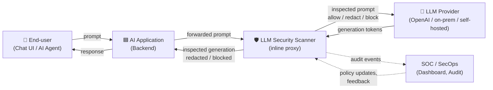

### 2.1. Топологические варианты интеграции

| Вариант | Где живёт сканер | Плюсы | Минусы | Когда выбирать |
|---|---|---|---|---|
| **A. Reverse Proxy** | Перед LLM-провайдером, отдельный сервис | Единая точка контроля, языко-агностичен | Дополнительный hop, задержка | Default для большинства случаев |
| **B. Sidecar** | Рядом с каждым инстансом AI-приложения | Низкая задержка, нет централизованного SPOF | Сложнее обновлять, расход ресурсов | K8s-деплой, latency-sensitive |
| **C. SDK / Library** | Внутри AI-приложения | Минимальная задержка, нет сетевого hop | Привязка к языку, сложнее обновлять детекторы | Прототипы, edge-деплой |
| **D. eBPF / Network Layer** | На уровне ядра | Прозрачно для приложения | Сложно инспектировать семантику | Трафик-уровневые политики |

**Рекомендация:** в MVP — **вариант A (Reverse Proxy)**, в Enterprise — **A + B** (централизованный proxy для cross-cutting политик, sidecar для per-app пользовательских политик). Подробное обоснование — в ADR-001.

---

## 3. Исходная архитектура (из презентации) — baseline

Восстановленная по слайдам архитектура:

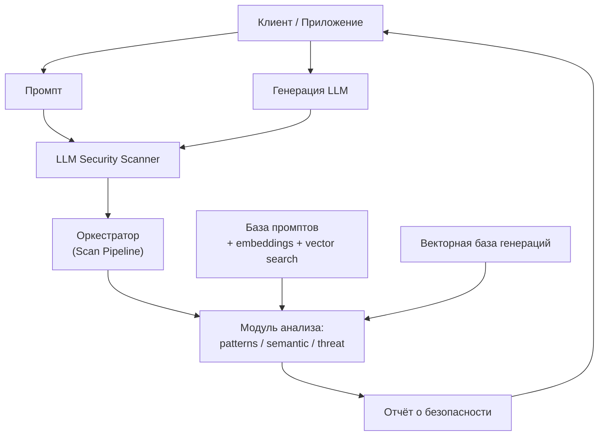

### 3.1. Что в baseline сделано хорошо

1. **Двунаправленная инспекция** — проверяются и промпты, и генерации. Это правильно: атаки через prompt injection часто проявляются только в генерации (например, jailbreak «покажи мне системный промпт»).
2. **Двойная база векторов** — отдельная база для известных атак и для «нормальных/аномальных» генераций. Разделение корректное, потому что threat model у них разный.
3. **Модульность анализаторов** — patterns / semantic / threat явно разведены, это позволяет независимо обновлять каждый слой.
4. **Локальное развёртывание** — для enterprise/regulated Industries это критичное требование (данные не покидают периметр).
5. **Расширяемость roadmap-модулями** (RAG, Vector DB, Enterprise Layer) — архитектура задумана как эволюционируемая.

---

## 4. Достроенная архитектура (target)

Ниже — расширение baseline недостающими компонентами. **Жирным** выделены новые блоки.

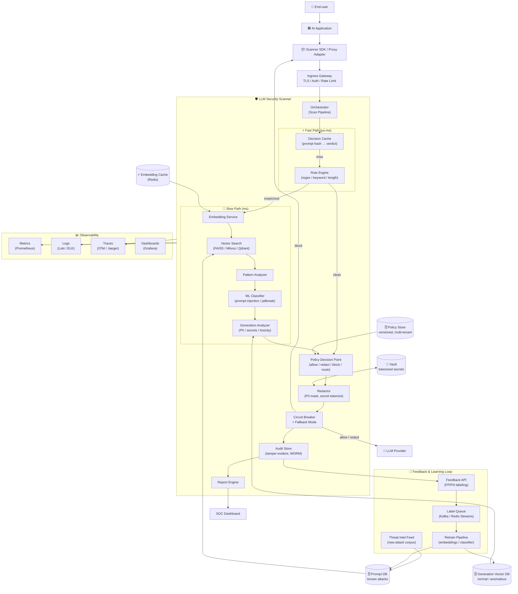

### 4.1. Что добавлено и зачем

| Новый компонент | Зачем нужен | Что без него сломается |
|---|---|---|
| **Ingress Gateway** | TLS-терминация, аутентификация, rate-limit, mTLS между клиентом и сканером | Без него сканер становится открытым прокси, любой может слать промпты |
| **Decision Cache** | Одинаковые промпты приходят повторно (system prompts, FAQ). Кеширование вердикта экономит 60–80% запросов к векторной БД | Без кеша latency растёт на 3–5× при типичной нагрузке |
| **Fast Path / Slow Path** | Regex и keyword детекторы работают за µs, векторный поиск — за ms. Разделение путей даёт p99 < 50ms | Без разделения p99 упирается в самый медленный детектор |
| **ML Classifier** | Семантический поиск ловит только **похожие** на известные атаки. Новый jailbreak, не похожий ни на один из corpus, будет пропущен. Нужен обученный классификатор (BERT-mini / DeBERTa) | FN на novel attacks до 40–60% |
| **Policy Decision Point (PDP)** | Что делать после обнаружения? Allow / redact / block / route-to-human / log-only. Решение зависит от tenant, risk score, policy version | Без PDP компонент «analysis» выдаёт сырой score, приложение само решает что делать — несовместимо с enterprise-требованиями |
| **Redactor** | PII и секреты нужно не просто обнаружить, а **заменить** до отправки в LLM (например, на `<TOKEN_VAULT_42>`). LLM работает с токеном, сканер подставляет оригинал обратно в ответ | Без redactor — утечка PII в LLM-провайдер, GDPR/ФЗ-152 violation |
| **Circuit Breaker + Fallback** | Если векторная БД или classifier упали, сканер не должен ронять приложение. Fallback: rule-only режим, или fail-open с пометкой «unscanned» | Без CB — каскадный сбой всего AI-приложения |
| **Audit Store (WORM)** | Для compliance нужен immutable лог: кто, когда, какой промпт, какой вердикт, какая политика применена. Tamper-evident (hashchain или appen-only S3 + Object Lock) | Без WORM-аудита нельзя доказать регулятору, что политика применялась |
| **Policy Store (versioned, multi-tenant)** | Политики разные для разных tenant, версий, окружений (dev/staging/prod). A/B-тестирование политик | Без версионирования невозможно откатить неудачную политику |
| **Embedding Cache** | Embedding-модель дорогая (CPU/GPU). Кеширование embedding по хешу промпта экономит 30–50% вычислений | Без кеша масштабирование упирается в GPU embedding-сервиса |
| **Vault** | Хранение токенизированных секретов и PII. Из LLM возвращается `<TOKEN_42>`, сканер через Vault подставляет реальное значение | Без Vault токен нельзя развернуть обратно, и LLM-ответ придёт с плейсхолдером |
| **Feedback API + Label Queue** | SecOps размечает FP/FN → label queue → retraining pipeline. Без обратной связи детекторы деградируют (concept drift) | Без feedback loop точность падает на 5–15% за квартал |
| **Threat Intel Feed** | Внешний источник новых атак (prompt-injection corpus, OWASP LLM Top-10 updates). Синхронизация с prompt DB | Без feed система слепа к новым атакам |
| **Observability (Metrics/Logs/Traces)** | p50/p95/p99 latency, detection rate, FP/FN rate, throughput, error budget | Без observability невозможно доказать SLO |
| **Red-team Automation** (в Roadmap) | Continuous red-teaming: автоматически гонять корпус джейлбрейков, измерять FN | Без red-team — детекторы тестируются только на production трафике |

---

## 5. Критический анализ исходной архитектуры

### 5.1. Архитектурные провалы (high-severity)

#### 🔴 C1. Сканер — синхронный блокирующий прокси без стриминга

LLM-провайдеры отдают токены **стримом** (SSE / WebSocket). Исходная архитектура предполагает «получить генерацию → проверить → отдать». Это значит:
- Либо сканер буферизует всю генерацию (пользователь ждёт N секунд до начала ответа — **UX-провал**),
- Либо сканер стримит без проверки (тогда **зачем он нужен**),
- Либо сканер проверяет «окном» по N токенов (нужно явно архитектурировать).

**Влияние:** 3–8 секунд дополнительной задержки при типичной генерации 500 токенов. Для чат-продуктов это недопустимо.

#### 🔴 C2. Нет Policy Decision Point — непонятно, что делать после детекции

В исходной архитектуре есть «Threat Detection → Security Report», но **отсутствует**:
- Какие действия доступны (allow / redact / block / route-to-human / log-only)?
- Кто решает (политика, человек, ML)?
- Что видит пользователь при блоке?

Без PDP сканер либо **блокирует всё подозрительное** (высокий FP → продукта нет), либо **только логирует** (тогда защиты нет).

#### 🔴 C3. Нет отказоустойчивости (no circuit breaker, no fallback)

Если векторная БД упала — сканер возвращает 500, AI-приложение ломается. Это нарушает базовое правило **security tool must not become a SPOF for the protected system**. Сканер должен уметь:
- fail-open (с пометкой `unscanned`) для некритичных политик,
- fail-closed (block) для критичных,
- деградировать до rule-only режима.

#### 🔴 C4. Утечка PII в LLM-провайдер

Сценарий: пользователь пишет «переведи мой контракт: Company X agrees to pay $1M to Y on 2026-12-31». Если контракт содержит NDA, PII, коммерческую тайну — сканер **должен** это редиректить/маскировать **до** отправки в LLM. В исходной архитектуре такого модуля нет.

**Влияние:** GDPR (ст. 5/32), ФЗ-152, CCPA — прямые нарушения, штрафы до 4% глобальной выручки.

#### 🔴 C5. Нет tamper-evident audit

Для regulated industries (finance, healthcare) логи должны быть **неизменяемыми**. Обычный PostgreSQL или файл логов можно подменить. Нужен WORM (Write-Once-Read-Many) — S3 Object Lock, append-only ledger (RethinkDB, immudb), или hashchain.

### 5.2. Архитектурные слабости (medium-severity)

#### 🟠 C6. Векторная база «генераций» — threat model не определён

В презентации есть отдельная «векторная база генераций», но **не описано**, что в ней хранится:
- «Нормальные» генерации (для anomaly detection)? — но什么是 «normal» зависит от домена, модели, задачи.
- «Аномальные» генерации (для matching известных утечек)? — но атаки разнообразны.
- Семантика проверки (cosine similarity threshold)?

Без чёткого threat model этот компонент превращается в **«vector DB of vibes»** — кажется полезным, но метрики нет.

#### 🟠 C7. Нет мультиарендности

Разные tenant'ы (команды/клиенты) имеют разные политики. В исходной архитектуре единая Policy Store / Prompt DB. Это значит:
- Tenant A может «утечь» red-team корпус в Tenant B,
- Невозможно A/B-тестировать политики,
- Невозможна изоляция данных.

#### 🟠 C8. Нет обновления threat-intel

База промптов статична. Но prompt-injection эволюционирует **ежедневно** (новые джейлбрейки, Dan-варианты, multi-modal атаки). Без feed:
- Сканер устаревает за 1–2 недели,
- SecOps должен вручную добавлять атаки.

#### 🟠 C9. Нет feedback loop

SecOps находит FP, но некуда его отправить. Размеченные данные не возвращаются в retrain. Это значит:
- Точность деградирует со временем (concept drift),
- Невозможно улучшать детекторы data-driven.

#### 🟠 C10. Embeddings пересчитываются на каждый запрос

Типичный AI-чат имеет много повторяющихся system prompts. Пересчёт embedding для каждого запроса — **лишние 5–15 ms и CPU/GPU**. Нужен кеш.

#### 🟠 C11. Нет версионирования политик

Политику нельзя откатить. Невозможно A/B-тестировать (например, «строгий jailbreak-детектор vs мягкий»). Невозможно доказать регулятору, какая политика действовала в момент инцидента.

### 5.3. Эксплуатационные проблемы (low-severity, но накопительные)

#### 🟡 C12. Нет observability-слоя

Нет стандартных метрик: latency percentiles, detection rate, FP/FN, throughput, error budget. Без этого невозможно доказать SLO или отлаживать инциденты.

#### 🟡 C13. Локальное развёртывание vs обновления

Требование «локальное развёртывание» противоречит «обновление threat-intel». Нужно явно разделить:
- Offline-режим: air-gapped, обновления через signed-bundle,
- Online-режим: pull threat-intel из центрального фида.

#### 🟡 C14. «Обратный инжиниринг LLM» — не архитектурирован

В слайде упомянут «reverse engineering of LLM / behavior analysis», но компонентной декомпозиции нет. Что именно: red-teaming automated? Probing? Behavioral fingerprinting? Без конкретики — это marketing bullet, не архитектура.

#### 🟡 C15. Нет secret/token классификатора

Regex для AWS keys, JWT, credit-card — стандартные паттерны. Без них сканер пропустит «AWS_ACCESS_KEY_ID=AKIA...» в промпте → утечка в LLM → утечка в логи LLM-провайдера.

---

## 6. Улучшения (concrete proposals)

### 6.1. Двухуровневый pipeline: Fast Path + Slow Path

**Проблема:** p99 latency упирается в самый медленный детектор (векторный поиск ~20–50ms).

**Решение:** разделить на два пути.

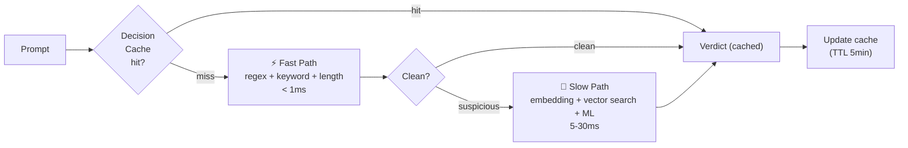

**Эффект:** 70–85% запросов укладываются в <1ms (cache hit или clean fast-path). Только 15–30% идут в slow path.

### 6.2. Streaming-aware inspection (token chunks)

**Проблема:** LLM стримит ответ, сканер не может ждать всю генерацию.

**Решение:** инспекция «окнами» по N токенов (например, N=8).

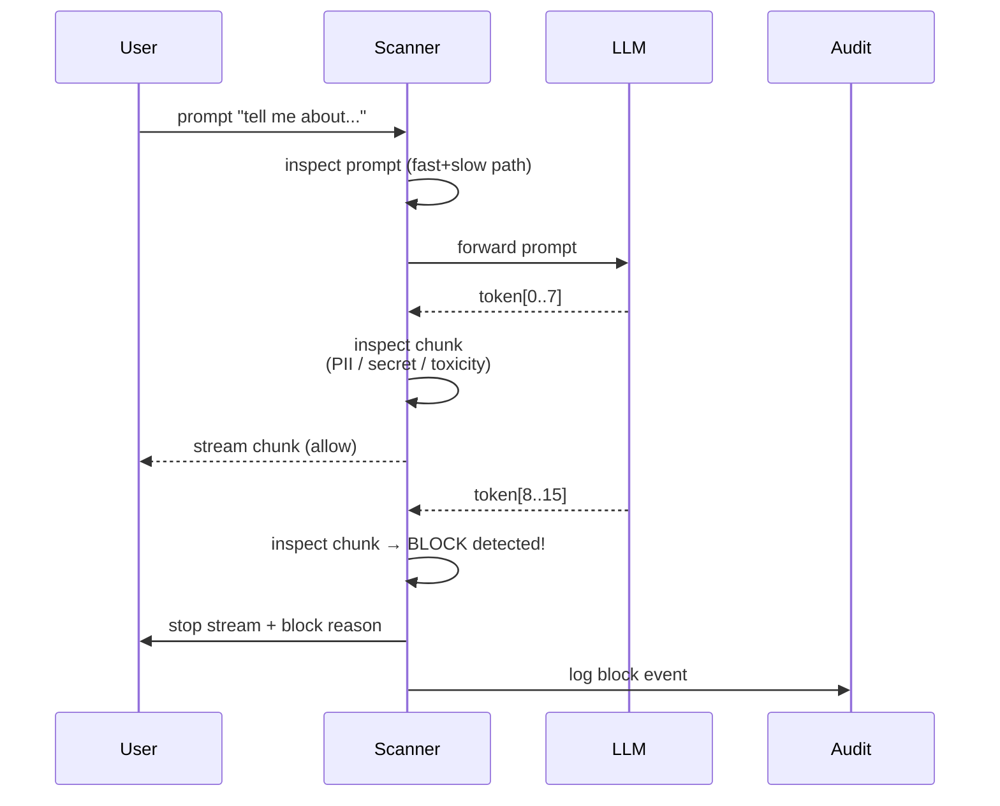

**Ключевые решения:**
- Буфер = N токенов (тюнинг trade-off: latency vs coverage).
- На каждом чанке: проверка regex (PII/secret) + быстрый ML-классификатор (toxicity).
- Полный deep-analysis (векторный поиск) — только на финальной генерации (async, post-factum).
- При обнаружении — terminate stream, вернуть `block` event.

### 6.3. Circuit Breaker + Fallback Mode

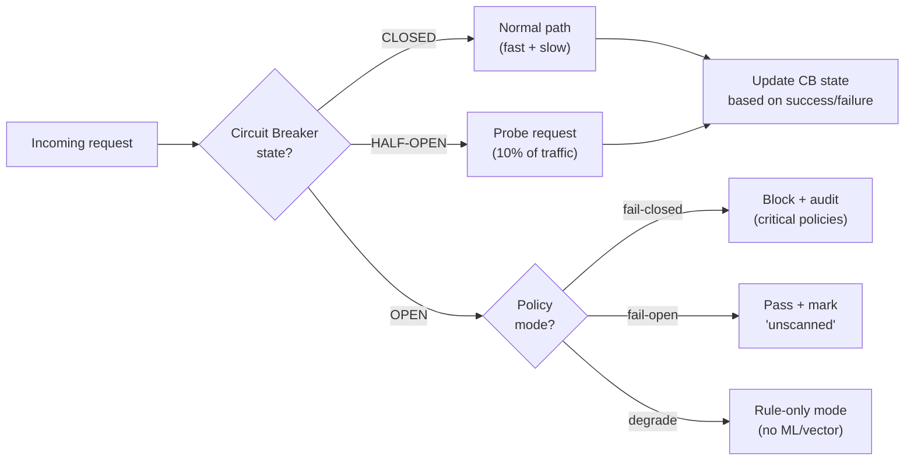

**Режимы:**
- `fail-closed` — критичные политики (PII, secret leakage): лучше блокировать, чем пропустить.
- `fail-open` — некритичные (toxicity): лучше пропустить, чем сломать продукт.
- `degrade` — fast path (rules) работает, slow path (vector/ML) выключен.

### 6.4. Policy Decision Point с версионированием и A/B

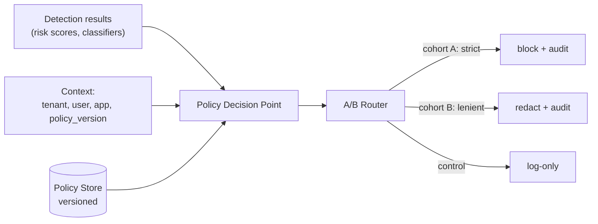

**Действия PDP:**
- `ALLOW` — пропустить без модификаций.
- `REDACT` — маскировать PII/secrets, пропустить.
- `BLOCK` — отклонить с указанием причины.
- `ROUTE_TO_HUMAN` — поставить в очередь ручной проверки (для high-risk low-confidence).
- `LOG_ONLY` — пропустить, но отправить в SecOps dashboard (canary-режим новой политики).

### 6.5. Feedback Loop + Continuous Learning

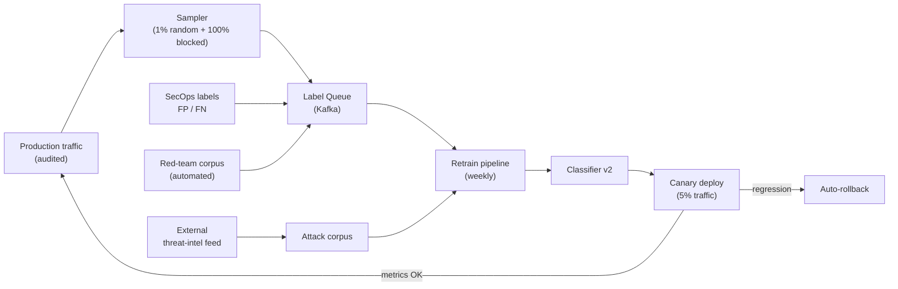

**Ключевые элементы:**
- SecOps размечает через dashboard (1-click FP/FN).
- Auto-red-team генерирует джейлбрейки (adv. perturbation, GCG-атаки).
- Canary deploy: новая модель работает на 5% трафика, если FP/FN хуже baseline — auto-rollback.

### 6.6. Мультиарендность и изоляция

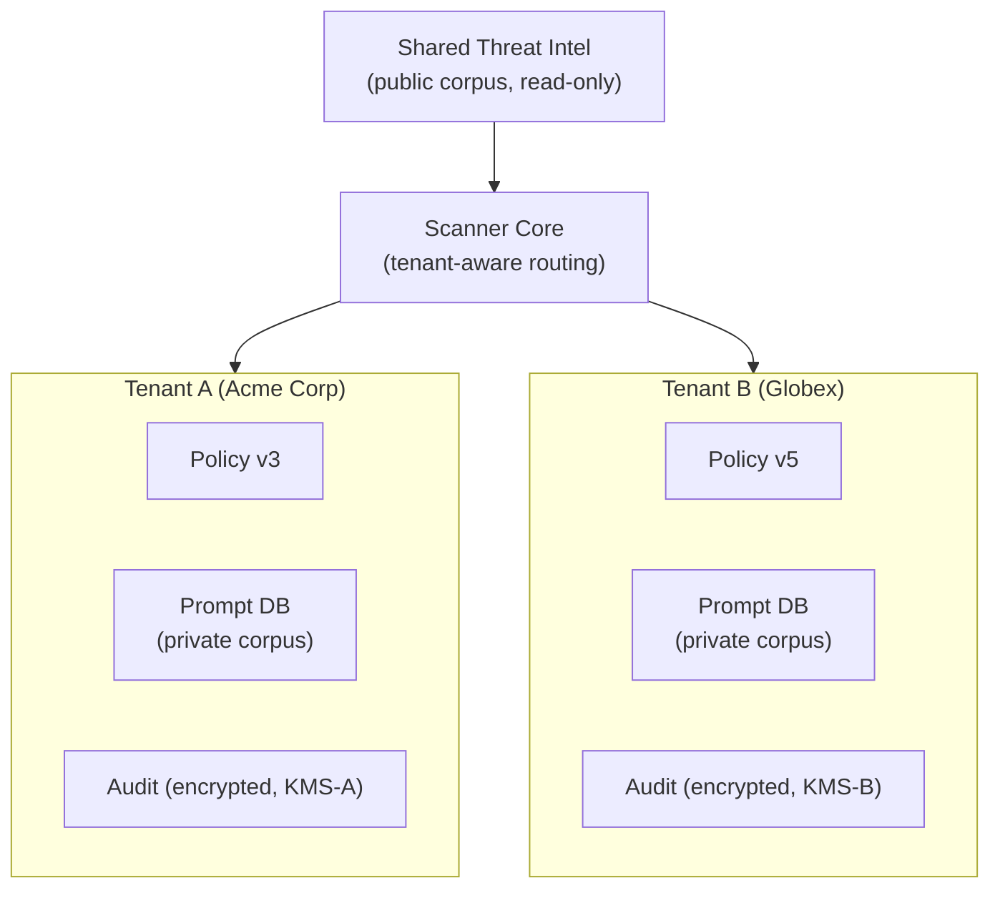

- Каждому tenant — отдельный KMS-ключ, отдельная Policy Store, отдельный audit.
- Shared threat-intel — только read-only, общий для всех.
- Row-level security в общем Vector DB (через tenant-id filter).

### 6.7. PII / Secret Redaction с Vault

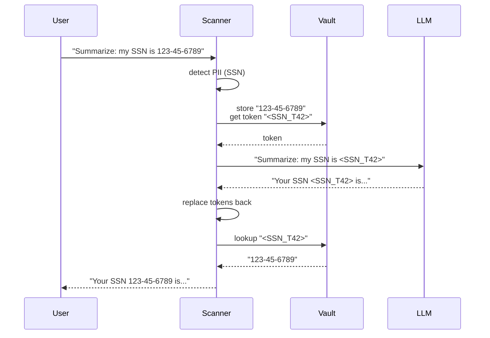

- Vault — короткий TTL (5 минут), авто-чистка.
- LLM никогда не видит реальное значение.
- Логи сканера — без PII (только token).

### 6.8. Tamper-evident Audit (hashchain)

```python
# Псевдокод
prev_hash = load_last_hash()
event = {ts, tenant, prompt_hash, verdict, policy_version}
event["prev_hash"] = prev_hash
event["hash"] = sha256(canonical_json(event))
append_to_worm_storage(event)  # S3 Object Lock / immudb
```

- Каждый event ссылается на хеш предыдущего.
- Любая подмена нарушает цепочку.
- Periodic snapshot в external notary (опционально, для regulated).

### 6.9. Threat Intel Sync (offline + online)

| Режим | Источник | Механизм | Latency |
|---|---|---|---|
| Online | Central threat-intel feed | Pull каждые 15 мин (signed JSON) | < 30 мин |
| Offline (air-gapped) | Signed bundle | SOC工程师 загружает через USB / internal artifact repo | 1–7 дней |
| Emergency | SOC manual push | Admin API + 2FA approval | < 5 мин |

---

## 7. Компонентная модель (detailed responsibilities)

### 7.1. Ingress Gateway

| Атрибут | Значение |
|---|---|
| Ответственность | TLS-терминация, аутентификация (mTLS / API-key), rate-limit, request routing |
| Технология | Envoy / Nginx / Caddy |
| SLO latency | p99 < 2ms |
| Масштабирование | stateless, горизонтально |

### 7.2. Orchestrator (Scan Pipeline)

| Атрибут | Значение |
|---|---|
| Ответственность | Координация fast/slow path, агрегация результатов детекторов, передача в PDP |
| Технология | Python (FastAPI + asyncio) / Go |
| SLO latency | p99 < 5ms overhead |
| Паттерн | Pipeline / Chain of Responsibility |

### 7.3. Rule Engine

| Атрибут | Значение |
|---|---|
| Ответственность | Regex (PII, secrets), keyword match, length checks, lang-detection |
| Технология | RE2 / Hyperscan (для high-throughput regex matching) |
| SLO latency | p99 < 1ms |
| Источник правил | External (TruffleHog rules, gitleaks patterns) + custom |

### 7.4. Embedding Service

| Атрибут | Значение |
|---|---|
| Ответственность | Преобразование текста в вектор (768/1024-dim) |
| Технология | Sentence-Transformers (multilingual-e5-large) / OpenAI text-embedding-3 (online mode) |
| Деплой | ONNX Runtime / Triton Inference Server, GPU (одна T4/A10 хватит для ~500 RPS) |
| Кеш | Redis, ключ = SHA256(text), TTL 24h |

### 7.5. Vector DB

| Атрибут | Значение |
|---|---|
| Ответственность | Хранение embeddings атак/генераций, ANN-поиск (cosine) |
| Технология | Qdrant / Milvus / Weaviate / pgvector (для малого объёма) |
| SLO latency | p99 < 30ms (search top-K=10) |
| Индекс | HNSW (для low-latency) или IVF-PQ (для большого объёма) |

### 7.6. ML Classifier

| Атрибут | Значение |
|---|---|
| Ответственность | Классификация промпта (prompt-injection / jailbreak / benign) |
| Технология | DeBERTa-v3-small fine-tuned на prompt-injection corpus |
| Деплой | ONNX / Triton, CPU-friendly (5–10ms inference) |
| Fallback | Если недоступен — fallback на rule-only mode |

### 7.7. Generation Analyzer

| Атрибут | Значение |
|---|---|
| Ответственность | Анализ ответа LLM: PII leakage, secret leakage, toxicity, topic-policy |
| Технология | Combination of regex (PII/secret) + ML (toxicity: RoBERTa-toxic) + LLM-as-judge (async, для сложных случаев) |
| Streaming | Inspect chunk-by-chunk (N=8 tokens) |

### 7.8. Policy Decision Point (PDP)

| Атрибут | Значение |
|---|---|
| Ответственность | Принятие решения на основе детекций + контекста + политики |
| Технология | Open Policy Agent (OPA) / Cedar / custom rules engine |
| Политики | Rego (OPA) / Cedar, versioned в Git |
| SLO latency | p99 < 2ms |

### 7.9. Redactor

| Атрибут | Значение |
|---|---|
| Ответственность | Замена PII/secrets на токены до отправки в LLM, обратная подстановка в ответе |
| Технология | Microsoft Presidio / custom NER + Vault integration |
| Vault | HashiCorp Vault / AWS Secrets Manager / on-prem equivalent |

### 7.10. Audit Store

| Атрибут | Значение |
|---|---|
| Ответственность | Tamper-evident лог всех решений |
| Технология | S3 + Object Lock (WORM) / immudb / RethinkDB append-only |
| Schema | {ts, tenant, request_id, prompt_hash, verdict, policy_version, prev_hash, hash} |
| Retention | 1 year hot, 7 years cold (compliance) |

### 7.11. Report Engine

| Атрибут | Значение |
|---|---|
| Ответственность | Формирование человекочитаемых отчётов для SecOps dashboard |
| Форматы | JSON (API), HTML (dashboard), PDF (compliance export) |
| Real-time | WebSocket для live-updates |

### 7.12. Feedback API

| Атрибут | Значение |
|---|---|
| Ответственность | Приём FP/FN labels от SecOps, публикация в Label Queue |
| Технология | REST + Kafka / Redis Streams |
| Auth | RBAC: только SecOps role |

### 7.13. Retrain Pipeline

| Атрибут | Значение |
|---|---|
| Ответственность | Переобучение classifier и обновление embeddings на основе labels |
| Технология | Kubeflow / Argo Workflows / MLflow |
| Schedule | Weekly + on-demand |
| Validation | Hold-out test set, auto-rollback if metrics regress > 5% |

### 7.14. Observability Stack

| Слой | Технология |
|---|---|
| Metrics | Prometheus + Grafana |
| Logs | Loki / ELK |
| Traces | OpenTelemetry → Jaeger / Tempo |
| Alerts | Alertmanager → PagerDuty / Slack |

---

## 8. Потоки данных (sequence diagrams)

### 8.1. Request path: User → LLM

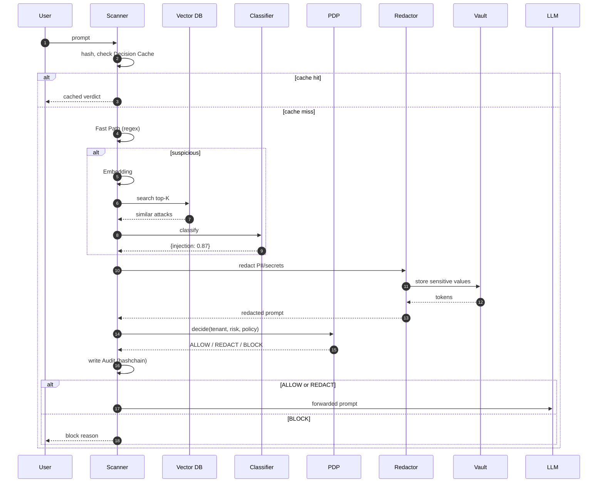

### 8.2. Response path: LLM → User (streaming)

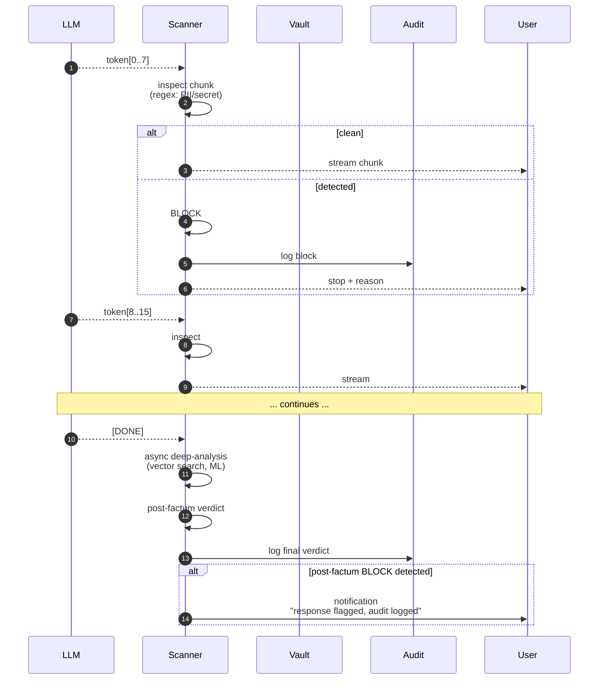

### 8.3. Async batch scanning

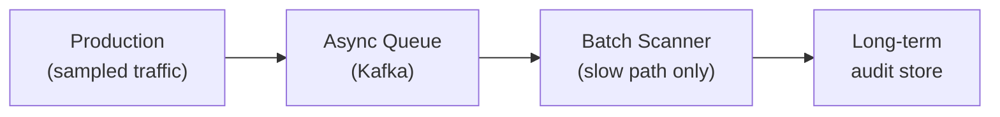

- 1% случайной выборки + 100% заблокированных идут на deep analysis.
- Используется для улучшения детекторов, не для inline-решений.

### 8.4. Feedback & retraining loop

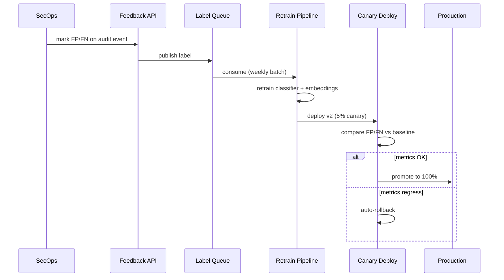

---

## 9. Deployment Topology

### 9.1. Local (on-prem) — primary target из презентации

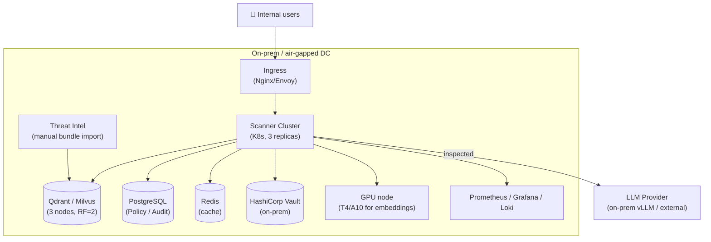

### 9.2. SaaS (multi-tenant cloud)

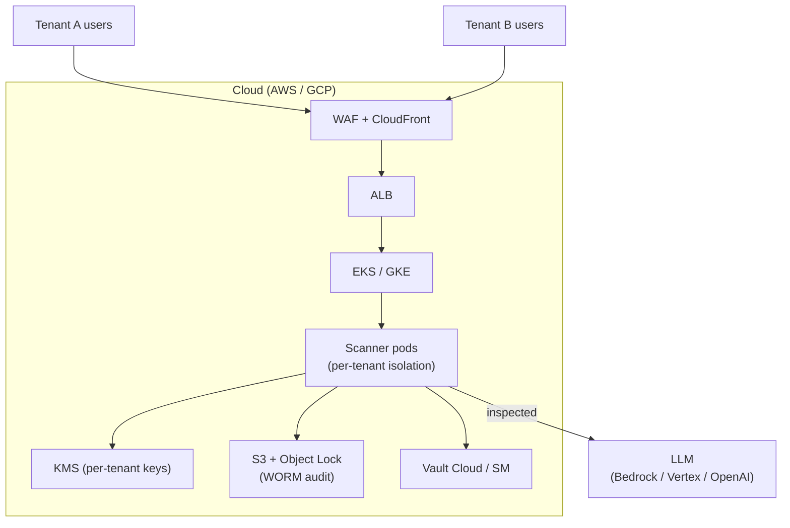

### 9.3. Sidecar (per-app)

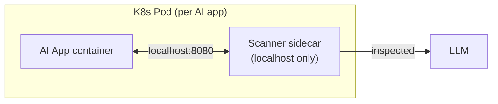

- Минимальная задержка (no network hop).
- Но обновлять детекторы нужно во всех подах одновременно.

---

## 10. Нефункциональные требования (NFR)

### 10.1. SLO

| Метрика | Target |
|---|---|
| Inline latency overhead (p50) | < 5 ms |
| Inline latency overhead (p99) | < 50 ms |
| Streaming chunk inspection (p99) | < 2 ms per chunk |
| Throughput (RPS, single tenant) | 500 RPS |
| Throughput (RPS, multi-tenant total) | 5000 RPS |
| Availability (scanner service) | 99.95% |
| Availability (with fail-open fallback) | 99.99% |
| Detection rate (known attacks) | > 95% |
| False positive rate | < 2% |
| Mean time to detect novel attack (after threat-intel update) | < 24h |
| Mean time to rollback bad policy | < 5 min |

### 10.2. RTO / RPO

| Аспект | RTO | RPO |
|---|---|---|
| Scanner service | 5 min | 0 (stateless) |
| Vector DB | 30 min | 5 min (streaming replication) |
| Policy / Audit DB | 15 min | 0 (sync replication) |
| Threat intel feed | 1 hour | 24h |

### 10.3.容量估算 (для sizing)

| Ресурс | На 1000 RPS | Обоснование |
|---|---|---|
| CPU (scanner pods) | 16 vCPU | Fast path + orchestration |
| GPU (embedding) | 1× T4 (16GB) | ~3ms embedding batch=32 |
| Memory | 32 GB | Caches + model |
| Vector DB | 16 GB RAM + 100 GB SSD | 1M vectors, 1024-dim, HNSW |
| Audit storage | 50 GB/month | ~1M events/day × 1KB |

---

## 11. Безопасность самого сканера

Сканер — это security tool, но **он сам — атакуемая цель**. Угрозы:

| Угроза | Митигация |
|---|---|
| Промпт-инъекция в сам сканер (через детектор) | Изоляция ML-моделей (no network), input sanitization |
| Похищение API-ключа сканера | mTLS + short-lived tokens (JWT, 5min TTL) |
| Утечка PII из логов сканера | Structured logging с redaction layer, PII → token перед логированием |
| Подмена политик | Git-signed policies, 2-eyes approval на merge |
| Подмена audit trail | Hashchain + external notary snapshot |
| DoS через сложные промпты | Token length limit, complexity score, rate-limit per tenant |
| Prompt DB poisoning | Подпись threat-intel bundles, source whitelist |
| Model extraction | Rate-limit embedding/classifier APIs, watermarking |

---

## 12. Наблюдаемость

### 12.1. Ключевые метрики (Prometheus)

```promql
# Latency
histogram_quantile(0.99, rate(scanner_request_duration_seconds_bucket[5m]))

# Detection
rate(scanner_detections_total{type="prompt_injection"}[5m])
rate(scanner_false_positives_total[5m])  # labeled by SecOps

# Cache
scanner_decision_cache_hit_ratio

# Circuit breaker
scanner_circuit_breaker_state{component="vector_db"}

# Throughput
rate(scanner_requests_total[5m])

# Errors
rate(scanner_errors_total{type="upstream_timeout"}[5m])
```

### 12.2. Distributed traces

Каждый запрос → 1 trace, span'ы на каждый компонент:
- `ingress`
- `orchestrator`
- `cache_lookup`
- `rule_engine`
- `embedding`
- `vector_search`
- `classifier`
- `pdp`
- `redactor`
- `audit_write`

### 12.3. Dashboards

- **Operational**: latency, throughput, error rate, CB state.
- **Security**: detection rate by type, top-10 flagged prompts, FP/FN trend.
- **Compliance**: audit completeness, hashchain integrity, policy version coverage.

### 12.4. Alerts

| Alert | Условие | Severity |
|---|---|---|
| HighLatency | p99 > 100ms за 5 мин | Warning |
| CircuitBreakerOpen | state=open за 1 мин | Critical |
| AuditWriteFailure | rate > 0 за 1 мин | Critical |
| HighFP | FP rate > 5% за 1 hour | Warning |
| VectorDBDown | health=fail за 1 мин | Critical |
| ThreatIntelStale | last_update > 24h | Warning |

---

## 13. Architecture Decision Records (ADR)

### ADR-001: Сканер как Reverse Proxy (не SDK, не sidecar-only)

**Контекст:** Нужна точка инспекции между пользователем и LLM. Варианты: A (Reverse Proxy), B (Sidecar), C (SDK), D (eBPF).

**Решение:** Reverse Proxy как primary, Sidecar как опция для latency-sensitive.

**Альтернативы:**
- SDK — привязка к языку, сложно обновлять.
- eBPF — не хватает семантики.

**Последствия:**
- + Единая точка контроля, языко-агностично.
- + Проще обновлять детекторы.
- − Дополнительный network hop (~1–2ms).
- − Single point of failure → митигируется circuit breaker + replica.

### ADR-002: Двухуровневый pipeline (Fast + Slow path)

**Контекст:** p99 latency budget < 50ms, но векторный поиск = 20–50ms.

**Решение:** Fast path (regex + cache, < 1ms) → slow path (embedding + vector + ML, 5–30ms) только для подозрительных.

**Альтернативы:**
- Все детекторы параллельно — p99 = max(latencies) = 50ms.
- Только fast path — низкая точность.

**Последствия:**
- + 70–85% запросов в < 1ms.
- + Гибкая замена slow path без изменения fast.
- − Нужно явно определять «suspicious» критерий в fast path.

### ADR-003: Streaming inspection «окнами» по N токенов

**Контекст:** LLM стримит токены, ждать всю генерацию — недопустимая задержка.

**Решение:** Инспекция чанками по 8 токенов (regex + lightweight ML), финальная проверка — async post-factum.

**Альтернативы:**
- Буферизовать всю генерацию → +3–8s latency. Неприемлемо.
- Стримить без проверки → нет защиты.
- Проверять каждый токен → овер-хед, не ловит multi-token атаки.

**Последствия:**
- + UX-приемлемая задержка (< 5ms per chunk).
- + Блокируется on-the-fly.
- − Multi-token атаки внутри чанка могут пропустить (mitigated: финальная async-проверка).

### ADR-004: Open Policy Agent как Policy Decision Point

**Контекст:** Нужен versioned, multi-tenant, A/B-testable policy layer.

**Решение:** Open Policy Agent (Rego), policies в Git, OPA bundle deploy.

**Альтернативы:**
- Custom rules engine — re-inventing wheel.
- Cedar (Amazon) — моложе, меньше community.
- Hardcoded in code — нет версионирования, нет A/B.

**Последствия:**
- + Rego выразительный, sandboxed.
- + Policies as code (Git, review, sign).
- − Rego learning curve для SecOps.

### ADR-005: Qdrant как primary Vector DB

**Контекст:** Нужен ANN-поиск по 1M–100M векторов, p99 < 30ms.

**Решение:** Qdrant (Rust, production-ready, supports payload filtering for multi-tenant).

**Альтернативы:**
- Milvus — мощнее, но сложнее в эксплуатации.
- pgvector — проще, но не масштабируется > 10M.
- Weaviate — good, но GraphQL-first не удобен для нас.

**Последствия:**
- + Простая эксплуатация, Rust-stability.
- + Payload filtering → tenant isolation в одной коллекции.
- − Меньше ecosystem чем у Milvus.

### ADR-006: Hashchain audit (не blockchain)

**Контекст:** Нужен tamper-evident audit для compliance, но без overhead blockchain.

**Решение:** Append-only storage (S3 Object Lock / immudb) + hashchain (каждый event содержит hash предыдущего).

**Альтернативы:**
- Blockchain — overkill, latency.
- Plain PostgreSQL — подменяем.
- Merkle tree periodic snapshot — близко, но сложнее.

**Последствия:**
- + Простая реализация, проверяемая целостность.
- + Periodic external notary snapshot → extra assurance.
- − Если первый event подменён — нужно bootstrap с trusted snapshot.

### ADR-007: Vault для tokenization (не inline encryption)

**Контекст:** PII/secrets нужно маскировать до LLM, разворачивать обратно в ответе.

**Решение:** HashiCorp Vault (или on-prem equivalent), short-lived tokens (5 min TTL).

**Альтернативы:**
- Inline reversible encryption (AES-GCM с ключом в KMS) — но LLM увидит ciphertext, не понятный.
- Format-preserving encryption — сложнее, не всегда нужно.

**Последствия:**
- + LLM никогда не видит реальное значение.
- + TTL гарантирует cleanup.
- − Vault — еще один SPOF → mitigaция: HA-режим Vault.

---

## 14. Roadmap (расширенный относительно презентации)

### Phase 1 — MVP (3 месяца)

- Reverse Proxy + Fast/Slow path
- Rule Engine + Embedding + Vector Search
- ML Classifier (prompt-injection)
- Decision Cache
- Basic PDP (allow/block only, hardcoded policies)
- Audit (PostgreSQL, без hashchain)
- Local deployment
- Basic dashboard

### Phase 2 — Production-hardened (3–6 месяцев)

- Streaming inspection
- Circuit breaker + fallback
- Hashchain audit + WORM storage
- Vault integration (PII redaction)
- OPA-based PDP (versioned, multi-tenant)
- Observability (Prometheus + Grafana + OTel)
- Feedback API + Label Queue
- Red-team automation v1

### Phase 3 — Enterprise (6–12 месяцев)

- Multi-tenant isolation (per-tenant KMS, policies, audit)
- A/B policy testing
- Retrain pipeline (Kubeflow)
- Threat intel sync (online + offline)
- Compliance exports (PDF, SIEM integration)
- SaaS deployment mode

### Phase 4 — Advanced (12+ месяцев, из презентации)

- **RAG Security Module**: валидация источников RAG, контроль качества данных, проверка актуальности.
- **Vector DB Security Module**: integrity проверки самой векторной БД (poisoning detection), мониторинг дрейфа embeddings.
- **Behavioral Analysis**: reverse-engineering LLM (probing, fingerprinting, behavioral anomalies).
- **Adversarial robustness**: automated GCG-attack generator, continuous red-team.
- **Cross-model policies**: политики, работающие на нескольких LLM-провайдерах с сохранением семантики.

---

## 15. Open Questions (на обсуждение с заказчиком)

1. **Сравнение с opensource-аналогами**: используем ли Lakera Guard / Prompt Security / LLM Guard как baseline, или строим с нуля? (Влияет на roadmap Phase 1).
2. **LLM-as-judge**: допустимо ли использование LLM для сложных решений (например, оценки семантической вредоносности)? Это добавляет задержку и стоимость, но повышает точность на novel attacks.
3. **Cross-tenant learning**: если Tenant A нашёл новый jailbreak, автоматически ли он попадает в shared threat-intel? (Privacy vs Security trade-off).
4. **Air-gapped vs Online**: точная классификация клиентов — сколько из них действительно air-gapped? Это определяет архитектуру threat-intel sync.
5. **Cost model**: кто платит за GPU (embeddings) — per-tenant или shared? Влияет на sizing.
6. **Streaming protocol**: SSE / WebSocket / gRPC streaming — что поддерживают клиенты? Влияет на реализацию streaming inspector.

---

## 16. Glossary

| Термин | Определение |
|---|---|
| **PDP** | Policy Decision Point — компонент, принимающий решение (allow/block/redact) |
| **WORM** | Write-Once-Read-Many — хранилище, где данные нельзя изменить после записи |
| **Hashchain** | Цепочка хешей, где каждый event ссылается на hash предыдущего |
| **HNSW** | Hierarchical Navigable Small World — алгоритм ANN-поиска |
| **ANN** | Approximate Nearest Neighbor — приближённый поиск ближайших соседей |
| **Jailbreak** | Атака на LLM, обходящая safety-инструкции |
| **Prompt injection** | Атака через встроенный в промпт вредоносный контент |
| **Canary deploy** | Деплой новой версии на небольшой % трафика для проверки |
| **Circuit breaker** | Паттерн: при ошибках upstream временно отключаемся от него |
| **mTLS** | Mutual TLS — двусторонняя TLS-аутентификация |

---

*Документ поддерживается в актуальном состоянии командой архитектуры. Изменения — через PR с review двух архитекторов.*
