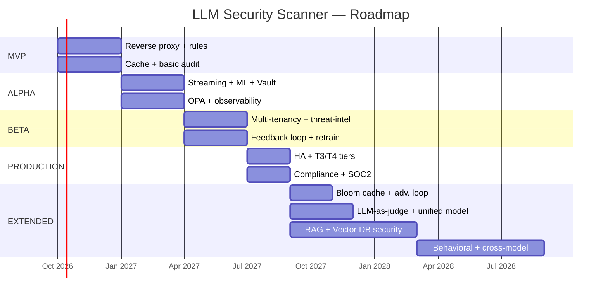

# ROADMAP.md — LLM Security Scanner

| | |
|---|---|
| **Версия документа** | 1.0 |
| **Дата** | 2026-09-27 |
| **Источник** | [ARCHITECT.md](ARCHITECT.md), [ADR.md](ADR.md), [ATRIZ.md](ATRIZ.md) |
| **Язык** | Русский |
| **Владелец** | Product / Architecture Team |

---

## 0. TL;DR — 5 фаз развития

| Фаза | Длительность | Цель | Кол-во ADR в работе |
|---|---|---|---|
| **MVP** | 3 мес. | Базовая инспекция промптов/генераций через reverse proxy | 4 (0001, 0002, 0014 partial) |
| **ALPHA** | 3 мес. | Streaming, ML-классификация, PDP, observability — внутренний usage | 6 (0003–0010) |
| **BETA** | 3 мес. | Multi-tenancy, threat-intel, feedback loop — early customers | 5 (0011–0015 + 0013) |
| **PRODUCTION** | 2 мес. | HA, compliance, hashchain audit, SLO — GA для всех | Доработка 0006, 0008, 0011 |
| **EXTENDED** | 6+ мес. | ТРИЗ-улучшения, RAG/Vector DB security, enterprise features | 14 (0016–0029) + Roadmap презентации |

**Общая длительность до GA:** ~11 месяцев. **EXTENDED** — параллельно с production support.

---

## 1. Принципы roadmap

1. **Phase gate review** — переход между фазами только при выполнении exit criteria (раздел 7).
2. **Vertical slices** — каждая фаза доставляет end-to-end функцию, не «половина всех компонентов».
3. **Production-readiness с MVP** — даже MVP деплоится как production (IaC, monitoring, on-call).
4. **ADR-driven** — каждая фаза явно привязана к ADR (см. раздел 6).
5. **ТРИЗ-улучшения не блокируют GA** — EXTENDED развивает параллельно.

---

## 2. Фаза MVP — Minimum Viable Product

| | |
|---|---|
| **Длительность** | 3 месяца (Месяцы 1–3) |
| **Команда** | 2 BE engineers, 1 ML engineer, 1 SRE, 1 PM |
| **Цель** | Reverse proxy + базовая инспекция промптов/генераций. Локальное развёртывание. First dogfooding. |

### 2.1. Scope

**Включено:**
- Reverse Proxy (ADR-0001) — базовый HTTP-прокси между AI-приложением и LLM.
- Rule Engine (regex) — PII patterns (SSN, email, passport), secrets (AWS keys, JWT, credit card).
- Decision Cache (ADR-0002 partial) — Redis, key=SHA256(prompt), TTL 5 min.
- Audit log (PostgreSQL, без hashchain) — для debugging.
- Basic Policy Decision Point — hardcoded actions (ALLOW / BLOCK).
- On-prem deployment (ADR-0014 partial) — Docker Compose, single-node.
- Basic dashboard — Grafana panel с request rate, latency, block rate.

**Исключено:**
- Streaming inspection (ALPHA).
- ML classifier, embeddings (ALPHA).
- Vault / redaction (ALPHA).
- Hashchain audit (BETA).
- Multi-tenancy (BETA).
- Threat-intel sync (BETA).

### 2.2. Ключевые deliverables

| # | Deliverable | Источник |
|---|---|---|
| M1.1 | Reverse proxy HTTP server (FastAPI/Go) | ADR-0001 |
| M1.2 | Rule engine: 20+ regex patterns (PII, secrets) | ARCHITECT 7.3 |
| M1.3 | Redis decision cache | ADR-0002 |
| M1.4 | PostgreSQL audit store (basic) | ARCHITECT 7.10 |
| M1.5 | Hardcoded PDP (allow/block) | ADR-0004 partial |
| M1.6 | Docker Compose deployment | ADR-0014 |
| M1.7 | Grafana dashboard (5 базовых метрик) | ADR-0015 partial |
| M1.8 | README + Quick Start | docs |

### 2.3. Exit criteria (gate to ALPHA)

- ✅ Reverse proxy пропускает 100 RPS на тестовом трафике.
- ✅ p99 latency < 10ms (без ML, cache hit rate > 50%).
- ✅ Rule engine ловит 100% PII-паттернов из тестового корпуса (1000 examples).
- ✅ Docker Compose разворачивается за < 10 минут.
- ✅ Dogfooding: 1 внутреннее AI-приложение использует сканер в проде.
- ✅ Базовый audit log сохраняет все решения.

### 2.4. Метрики фазы

| Метрика | Target MVP | Факт |
|---|---|---|
| RPS sustained | 100 | TBD |
| p99 latency | < 10ms | TBD |
| Cache hit rate | > 50% | TBD |
| Detection rate (regex-класс) | > 95% | TBD |
| Uptime | 99% | TBD |

---

## 3. Фаза ALPHA — Внутренний usage

| | |
|---|---|
| **Длительность** | 3 месяца (Месяцы 4–6) |
| **Команда** | +1 ML engineer, +1 SRE |
| **Цель** | Streaming, ML, Vault redaction, PDP на OPA, observability. Использование внутри компании несколькими командами. |

### 3.1. Scope

**Включено:**
- Streaming inspection (ADR-0003) — чанковая инспекция генераций, N=8 токенов.
- Embedding service (ADR-0009) — multilingual-e5 + ONNX Runtime.
- Vector DB (ADR-0005) — Qdrant, базовый корпус атак (~10K examples).
- ML classifier (ADR-0010) — DeBERTa-v3-small fine-tuned.
- Two-tier pipeline (ADR-0002 complete) — fast path + slow path.
- Policy Decision Point (ADR-0004) — Open Policy Agent с Rego policies.
- PII Redaction (ADR-0007) — Vault tokenization, reversible.
- Circuit Breaker (ADR-0008) — fail-open / fail-closed per policy.
- Observability (ADR-0015) — Prometheus + Grafana + Loki + OTel traces.

**Исключено:**
- Multi-tenancy (BETA).
- Threat-intel sync (BETA) — corpus обновляется вручную.
- Hashchain audit (BETA).
- Feedback loop / retrain (BETA).

### 3.2. Ключевые deliverables

| # | Deliverable | Источник |
|---|---|---|
| A2.1 | Streaming inspector для SSE/gRPC | ADR-0003 |
| A2.2 | Embedding service (Triton, GPU) | ADR-0009 |
| A2.3 | Qdrant с 10K векторов атак | ADR-0005 |
| A2.4 | ML classifier fine-tuned, F1 > 0.85 | ADR-0010 |
| A2.5 | OPA integration с Rego policies | ADR-0004 |
| A2.6 | Vault integration для PII tokenization | ADR-0007 |
| A2.7 | Circuit Breaker per-upstream | ADR-0008 |
| A2.8 | OTel instrumentation + Jaeger traces | ADR-0015 |
| A2.9 | Prometheus + Grafana operational dashboard | ADR-0015 |
| A2.10 | Alertmanager + 5 базовых алертов | ADR-0015 |

### 3.3. Exit criteria (gate to BETA)

- ✅ Streaming inspection работает на SSE-стриме OpenAI-совместимого API.
- ✅ p99 latency < 50ms (slow path) на тестовом трафике 500 RPS.
- ✅ ML classifier F1 > 0.85 на hold-out test set.
- ✅ Vault tokenization round-trip (< 5ms) для 5 PII-типов.
- ✅ 3 internal AI-приложения используют сканер.
- ✅ Все компоненты instrumented с OTel traces.
- ✅ 5 базовых алертов активны (HighLatency, CB Open, ErrorRate, VectorDBDown, MLDown).

### 3.4. Метрики фазы

| Метрика | Target ALPHA |
|---|---|
| RPS sustained | 500 |
| p99 latency (inline) | < 50ms |
| ML F1 (prompt-injection) | > 0.85 |
| FP rate | < 5% |
| Cache hit rate (decision) | > 40% |
| Streaming chunk inspect latency | < 5ms per chunk |
| Uptime | 99.5% |

---

## 4. Фаза BETA — Early customers

| | |
|---|---|
| **Длительность** | 3 месяца (Месяцы 7–9) |
| **Команда** | +1 ML engineer, +1 customer success, +1 security engineer |
| **Цель** | Multi-tenancy, threat-intel sync, feedback loop. Onboarding 3–5 early-design partner customers. |

### 4.1. Scope

**Включено:**
- Multi-tenancy (ADR-0011) — logical isolation, per-tenant KMS, payload filter в Qdrant.
- Hashchain audit (ADR-0006) — S3 + Object Lock / MinIO, tamper-evident.
- Threat-intel sync (ADR-0012) — online pull каждые 15 мин, signed bundles.
- Feedback loop (ADR-0013) — SecOps FP/FN labeling, label queue.
- Retrain pipeline (ADR-0013) — weekly, MLflow registry.
- Tiered Multi-tenancy (ADR-0018, ТРИЗ) — 2 tier'а (SMB + Enterprise) из 4.
- Tiered Audit Storage (ADR-0006 expansion) — hot 30d / cold 1y.
- Compliance export — PDF для auditor.
- K8s deployment (Helm chart).

**Исключено:**
- SaaS deployment (PRODUCTION).
- Air-gapped clients (PRODUCTION).
- T3/T4 tiers (PRODUCTION/EXTENDED).

### 4.2. Ключевые deliverables

| # | Deliverable | Источник |
|---|---|---|
| B3.1 | Multi-tenant routing + per-tenant KMS | ADR-0011 |
| B3.2 | Hashchain audit engine | ADR-0006 |
| B3.3 | Threat-intel sync (online + signed) | ADR-0012 |
| B3.4 | Feedback API + SecOps dashboard | ADR-0013 |
| B3.5 | Retrain pipeline (weekly) + MLflow | ADR-0013 |
| B3.6 | Canary deploy mechanism | ADR-0013 |
| B3.7 | Tiered isolation (T1 + T2) | ADR-0018 |
| B3.8 | Helm chart v1 | ADR-0014 |
| B3.9 | Compliance PDF export | ADR-0006 |
| B3.10 | Customer onboarding playbook | docs |

### 4.3. Exit criteria (gate to PRODUCTION)

- ✅ 3 design partner customers onboarded (1 SMB, 2 Enterprise).
- ✅ Hashchain audit verified за 30 дней без tamper.
- ✅ Threat-intel auto-sync работает 30 дней без ручного вмешательства.
- ✅ Feedback loop: 100+ labeled events от SecOps, использованы в 1 retrain cycle.
- ✅ Canary deploy: 2 successful model updates без rollback.
- ✅ p99 latency < 50ms сохраняется на multi-tenant трафике.
- ✅ Customer NPS > 7/10.

### 4.4. Метрики фазы

| Метрика | Target BETA |
|---|---|
| Активные tenants | 3+ |
| RPS multi-tenant | 1500 |
| Threat-intel staleness | < 30 min |
| Weekly retrain success rate | 100% |
| Hashchain integrity | OK (0 failures) |
| Customer NPS | > 7/10 |
| Uptime | 99.9% |

---

## 5. Фаза PRODUCTION — General Availability

| | |
|---|---|
| **Длительность** | 2 месяца (Месяцы 10–11) |
| **Команда** | +1 customer success, +1 compliance officer |
| **Цель** | GA для всех клиентов. SaaS + on-prem + air-gapped. SLA, compliance certifications. |

### 5.1. Scope

**Включено:**
- HA deployment (ADR-0001 + ADR-0008) — multi-AZ, replica = 3.
- T3 Regulated tier (ADR-0018) — dedicated scanner pods per tenant.
- T4 Air-gapped tier (ADR-0018) — full silo deployment.
- Emergency threat-intel push (ADR-0012) — admin API + 2FA.
- Audit notary snapshots (ADR-0006) — external notary, daily signed snapshots.
- Advanced observability — security + compliance dashboards.
- SLO monitoring — error budget tracking, alert on burn rate.
- Compliance: GDPR/ФЗ-152 review, SOC 2 preparation.
- Documentation: admin guide, integration guide, API reference.
- Customer SLA: 99.95% uptime, RTO 5min, RPO 0 для audit.

**Исключено:**
- ТРИЗ-улучшения (EXTENDED — параллельно).
- RAG/Vector DB security modules (EXTENDED).
- LLM-native PII via RLHF (EXTENDED).

### 5.2. Ключевые deliverables

| # | Deliverable | Источник |
|---|---|---|
| P4.1 | Multi-AZ HA deployment | ADR-0001, 0008 |
| P4.2 | T3 Regulated tier | ADR-0018 |
| P4.3 | T4 Air-gapped bundle + offline license | ADR-0012, 0014 |
| P4.4 | Emergency threat-intel push API | ADR-0012 |
| P4.5 | Audit notary (external, daily snapshots) | ADR-0006 |
| P4.6 | Security + compliance Grafana dashboards | ADR-0015 |
| P4.7 | SLO monitoring + error budget alerts | ADR-0015 |
| P4.8 | GDPR / ФЗ-152 compliance review | compliance |
| P4.9 | SOC 2 Type I preparation | compliance |
| P4.10 | Public documentation + API reference | docs |
| P4.11 | SLA agreement (99.95%) | business |
| P4.12 | Runbooks for on-call (5 scenarios) | SRE |

### 5.3. Exit criteria (GA)

- ✅ HA deployment: 99.95% uptime за 30 дней на prod traffic.
- ✅ T3 tenant onboarded (regulated industry — bank или healthcare).
- ✅ T4 air-gapped deployment — 1 customer.
- ✅ SOC 2 Type I audit started.
- ✅ Compliance export прошел external audit.
- ✅ All SLO monitored, error budget tracking live.
- ✅ Public documentation: 100% API endpoints documented.

### 5.4. Метрики фазы (GA)

| Метрика | Target GA |
|---|---|
| Uptime | 99.95% |
| Inline p99 latency | < 50ms |
| Streaming p99 per chunk | < 5ms |
| Detection rate (known attacks) | > 95% |
| FP rate | < 2% |
| RPS per tenant | 500 |
| RPS total (SaaS) | 5000 |
| RTO | 5 min |
| RPO (audit) | 0 |
| Customer count | 10+ |

---

## 6. Фаза EXTENDED — ТРИЗ-улучшения и расширения

| | |
|---|---|
| **Длительность** | 6+ месяцев (Месяцы 12+, параллельно с PRODUCTION support) |
| **Команда** | Research group + ML team + product |
| **Цель** | Применение ТРИЗ-решений (ATRIZ.md), расширение roadmap-модулями из презентации (RAG, Vector DB security, Enterprise Layer). |

### 6.1. Scope

**ТРИЗ-улучшения (в порядке ROI):**

| Подфаза | ADR | Приоритет |
|---|---|---|
| 6.1.1 Bloom filter cache | ADR-0017 | ⭐⭐⭐⭐⭐ |
| 6.1.2 Adversarial reinforcement loop | ADR-0025 | ⭐⭐⭐⭐⭐ |
| 6.1.3 Detector fan-out + early-exit | ADR-0016 | ⭐⭐⭐⭐ |
| 6.1.4 LLM-as-judge fallback | ADR-0020 | ⭐⭐⭐⭐ |
| 6.1.5 Unified embedding+classifier model | ADR-0019 | ⭐⭐⭐ |
| 6.1.6 Predictive streaming inspector | ADR-0022 | ⭐⭐⭐ |
| 6.1.7 Adaptive policy complexity | ADR-0024 | ⭐⭐⭐ |
| 6.1.8 Predictive cache invalidation | ADR-0021 | ⭐⭐⭐ |
| 6.1.9 Cache proxy + per-tenant filter | ADR-0026 | ⭐⭐⭐ |
| 6.1.10 Self-healing scanner | ADR-0027 | ⭐⭐⭐ |
| 6.1.11 T3 + T4 tier (из ADR-0018) | (done in PRODUCTION) | — |
| 6.1.12 LLM-native PII via RLHF | ADR-0023 | ⭐⭐ |
| 6.1.13 Neural policy engine | ADR-0028 | ⭐⭐ |
| 6.1.14 Serverless scanner | ADR-0029 | ⭐⭐ |

**Расширения из презентации:**

| Модуль | Что делает | Когда |
|---|---|---|
| **RAG Security Module** | Валидация источников RAG, контроль качества данных, проверка актуальности | EXTENDED-1 |
| **Vector DB Security Module** | Integrity проверки векторной БД, poisoning detection, мониторинг дрейфа | EXTENDED-2 |
| **Behavioral Analysis** | Reverse-engineering LLM, probing, behavioral fingerprinting | EXTENDED-3 |
| **Adversarial robustness** | Automated GCG-attacks, continuous red-team | EXTENDED-4 |
| **Cross-model policies** | Политики, работающие на нескольких LLM-провайдерах | EXTENDED-5 |
| **Enterprise Layer** | Полная корпоративная система безопасности AI/LLM | EXTENDED-6 |

### 6.2. Ключевые deliverables

| # | Deliverable | Источник |
|---|---|---|
| E5.1 | Bloom filter verdict cache (60% трафика в < 0.1ms) | ADR-0017 |
| E5.2 | Adversarial reinforcement loop (атаки → corpus) | ADR-0025 |
| E5.3 | Detector fan-out с early-exit | ADR-0016 |
| E5.4 | LLM-as-judge fallback (< 1% трафика) | ADR-0020 |
| E5.5 | Unified model (e5 + classification head) | ADR-0019 |
| E5.6 | RAG Security Module v1 | Roadmap презентации |
| E5.7 | Vector DB Security Module v1 | Roadmap презентации |
| E5.8 | Behavioral Analysis v1 | Roadmap презентации |
| E5.9 | Cross-model policies | Roadmap презентации |
| E5.10 | Enterprise Layer integration | Roadmap презентации |

### 6.3. Exit criteria (для каждого ТРИЗ-улучшения)

- ✅ PoC: реализация + benchmark на тестовом трафике.
- ✅ Comparison с baseline: latency/cost/accuracy.
- ✅ Decision: promote в PRODUCTION / отклонить / отложить.

### 6.4. Метрики фазы EXTENDED

| Метрика | Target |
|---|---|
| Inline p99 latency (после ТРИЗ) | < 20ms (вместо 50ms) |
| GPU cost (после ADR-0019) | -50% |
| Novel attack detection rate | > 90% (после ADR-0025) |
| Bloom cache hit rate | > 60% |
| RAG module customers | 3+ |

---

## 7. Cross-phase dependencies

### 7.1. Зависимости фаз

### 7.2. Зависимости ADR

| ADR | Зависит от | Блокирует |
|---|---|---|
| ADR-0002 (Two-tier) | ADR-0001 | ADR-0009, 0010 (slow path) |
| ADR-0003 (Streaming) | ADR-0001 | ADR-0007 (Vault in streaming) |
| ADR-0007 (Vault) | ADR-0008 (CB for Vault) | ADR-0011 (multi-tenant) |
| ADR-0011 (Multi-tenancy) | ADR-0007 | ADR-0006 (per-tenant audit) |
| ADR-0013 (Feedback) | ADR-0015 (observability) | ADR-0010 (retrain) |
| ADR-0017 (Bloom cache) | ADR-0002 | ADR-0021 (predictive invalidation) |
| ADR-0019 (Unified model) | ADR-0009 + ADR-0010 | ADR-0025 (adversarial loop) |

### 7.3. Gantt chart (упрощённый)

---

## 8. Риски и митигации

| Риск | Вероятность | Impact | Митигация |
|---|---|---|---|
| ML classifier F1 < 0.85 на ALPHA | Medium | High | Cold-start с pre-trained OpenAI/Anthropic classifier, постепенный fine-tune |
| Vault latency пробивает SLO | Low | High | Cache Vault tokens, async redaction для streaming |
| Customer onboarding медленнее плана | High | Medium | Design partner программа с 3 клиентами заранее |
| Qdrant не масштабируется > 10M векторов | Low | High | Migration plan к Milvus (ADR-0005 alt) |
| Compliance audit выявит blockers | Medium | Critical | Pre-audit на BETA, external consultant |
| ТРИЗ-улучшения не дают ожидаемого ROI | High | Low | PoC + metrics перед promote в PROD |

---

## 9. Ресурсы и бюджет (high-level)

| Фаза | Команда | FTE-месяцев | Cost (rough) |
|---|---|---|---|
| MVP | 5 человек × 3 мес | 15 | $150K |
| ALPHA | 7 человек × 3 мес | 21 | $250K (включая GPU) |
| BETA | 10 человек × 3 мес | 30 | $400K |
| PRODUCTION | 11 человек × 2 мес | 22 | $300K (включая compliance) |
| EXTENDED | 8 человек × 6 мес | 48 | $600K |
| **Total до GA** | | **88 FTE-мес** | **$1.1M** |
| **EXTENDED** | | **48 FTE-мес** | **$600K** |
| **Grand Total** | | **136 FTE-мес** | **$1.7M** |

GPU infrastructure: $2K/мес на T4 ноду × 11 мес до GA = $22K.

---

## 10. Phase Gate Review checklist

Перед каждой фазой — формальный review с участием Architecture Team, SecEng, SRE, Product.

### 10.1. MVP → ALPHA gate

- [ ] MVP exit criteria выполнены (раздел 2.3).
- [ ] Команда ALPHA укомплектована.
- [ ] GPU инфраструктура готова.
- [ ] ML corpus (10K labeled examples) собран.
- [ ] Threat model обновлён.

### 10.2. ALPHA → BETA gate

- [ ] ALPHA exit criteria выполнены (раздел 3.3).
- [ ] 3 design partner customers signed LOI.
- [ ] Legal review multi-tenant agreement.
- [ ] Compliance pre-audit scheduled.

### 10.3. BETA → PRODUCTION gate

- [ ] BETA exit criteria выполнены (раздел 4.3).
- [ ] HA infrastructure deployed.
- [ ] SOC 2 audit kicked off.
- [ ] SLA agreement template approved by legal.
- [ ] Runbooks tested (chaos engineering).

### 10.4. PRODUCTION → EXTENDED gate

- [ ] GA exit criteria выполнены (раздел 5.3).
- [ ] 10+ paying customers.
- [ ] Research group assembled.
- [ ] PoC backlog prioritized (ТРИЗ ROI matrix).

---

## 11. Связанные документы

- [ARCHITECT.md](ARCHITECT.md) — архитектура системы.
- [ADR.md](ADR.md) — все 29 архитектурных решений.
- [ATRIZ.md](ATRIZ.md) — ТРИЗ-анализ.
- [BACKLOG.md](BACKLOG.md) — детальный backlog задач.
- [worklog.md](../worklog.md) — журнал работ.

---

*Roadmap — живой документ. Пересмотр — на phase gate reviews.*
